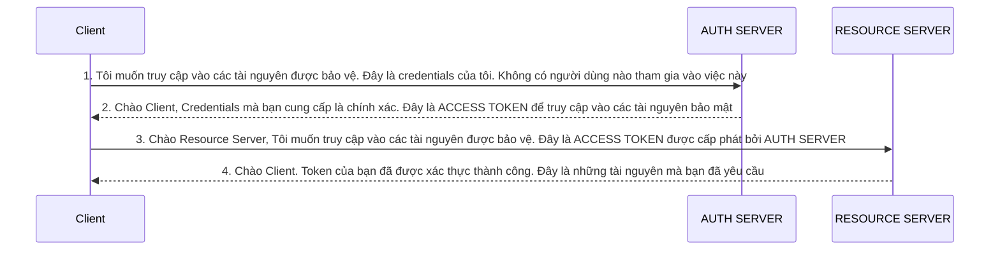

# Bảo mật (Security) trong Microservices
## 1. Giới thiệu
`Microservices` là một kiến trúc phần mềm mà ứng dụng được chia thành các dịch vụ nhỏ, độc lập, mỗi dịch vụ có thể được phát triển, triển khai và mở rộng một cách độc lập. Mỗi dịch vụ có thể được viết bằng ngôn ngữ lập trình khác nhau và có thể sử dụng công nghệ lưu trữ dữ liệu khác nhau. Mỗi dịch vụ có thể được triển khai trên một máy chủ hoặc một nhóm máy chủ riêng biệt.

Do trong `Microservices` mỗi dịch vụ là một ứng dụng độc lập, có thể lên đến hàng trăm hoặc hàng nghìn dịch vụ, nên việc quản lý bảo mật cho từng dịch vụ trở nên phức tạp hơn so với kiến trúc monolithic. Vì vậy việc cấu hình `bảo mật` trong từng `service` là không khả thi.

Để giải quyết vấn đề này, chúng ta cần một cơ chế bảo mật ở mức hệ thống, tập trung để quản lý và kiểm soát quyền truy cập của các dịch vụ. 

> Ví dụ: Hệ sinh thái `Google` sử dụng `OAuth2` để quản lý quyền truy cập giữa các dịch vụ. Các ứng dụng con như `Gmail`, `Google Drive`, `Google Calendar` sẽ sử dụng `OAuth2` để xác thực và truy cập dữ liệu từ ứng dụng cha là `Google Account`. Ứng dụng cha ko cần cấp `password` mà chỉ cần cung cấp các `token` và `thông tin cần thiết` cho các ứng dụng con, còn việc xác thực và quản lý quyền truy cập sẽ do `OAuth2` quản lý.

Một số cơ chế bảo mật phổ biến được sử dụng trong `Microservices` như `OAuth2/OpenID Connect`, `Keycloak` với Spring sẽ là `Spring Security`.

### 1.1. OAuth2
`Oauth` viết tắt của `Open Authorization` là một giao thức xác thực mở được thiết kế để cung cấp một cách cho ứng dụng truy cập vào dữ liệu của người dùng mà không cần biết `password`. `OAuth2` là phiên bản tiếp theo của `OAuth` với nhiều cải tiến và bổ sung.

Dưới đây là một số lợi ích của `OAuth2`:
- `Hỗ trợ tất cả các ứng dụng`: `OAuth2` hỗ trợ tất cả các ứng dụng, từ ứng dụng web, ứng dụng di động, ứng dụng desktop, ứng dụng IoT, ...
- `Tách biệt các logic xác thực`: Bên trong `OAuth2`, chúng ta có một `Authorization Server`, nó nhận các request từ client cho việc lấy `access token` và `phát hành` chúng nếu client được xác thực thành công. Điều này giúp chúng ta dễ dàng bảo trì tất cả `security logic` ở một nơi duy nhất. Tất cả `user credentials` và `application credentials` đều được lưu trữ ở một nơi duy nhất bên trong `Authorization Server`.
- `Không cần chia sẻ Credentials`: Nếu chúng ta cho phép dịch vụ thứ 3 truy cập vào tài nguyên của mình, thì sẽ không cần phải chia sẻ `credentials` với họ. Thay vào đó, chúng ta có thể cấp cho họ một `access token` mà họ có thể sử dụng để truy cập vào tài nguyên của mình.

**Các thuật ngữ trong OAuth2:**
- `Resource Owner`: Là người sở hữu tài nguyên, có thể là người dùng hoặc ứng dụng.
- `Client`: Là ứng dụng muốn truy cập vào tài nguyên của `Resource Owner`, ví dụ như ứng dụng di động, ứng dụng web, ...
- `Authorization Server`: Là server chịu trách nhiệm xác thực `Resource Owner` và cấp `access token` cho `Client`.
- `Resource Server`: Là server chứa tài nguyên mà `Client` muốn truy cập.
- `Scopes`: Là các quyền, phạm vi truy cập mà `Client` muốn truy cập từ `Resource Owner`.

### 1.2. OpenID Connect
`OpenID Connect` là một giao thức nằm ở trên của `Oauth2 Framework`. Trong khi `Oauth2` cung cấp `ủy quyền` thông qua `access token` chứa các phạm vi `scopes` thì `OpenID Connect` cung cấp `xác thực` thông qua `ID token` chứa một thông tin thiết lập mới và các `claims` cụ thể về danh tính của người dùng.

Với `ID token`, `OpenID Connect` cung cấp một cách để xác thực thông tin chi tiết về người dùng mà không cần phải chia sẻ `credentials` giữa các ứng dụng.

Xác nhận danh tính là chìa khóa truy cập bất kỳ dịch vụ nào cần xác thực người dùng. Cốt lõi ủy quyền hiện đại (authorization) chính là `Oauth2`, nhưng `Oauth2` lại thiếu phần `xác thực` người dùng. Việc triển khai `OpenID Connect` trên `Oauth2` sẽ hoàn thành chiến lực IAM (Identity and Access Management) - Quản lý danh tính và quyền truy cập.

`OpenID` thêm vào `Oauth2` những chi tiết sau:
1. `OIDC` tiêu chuẩn hóa các `phạm vi` (scopes) thành `openid`, `profile`, `email`, `address`, `phone`, `offline_access`, `roles`, ...
2. `ID Token` chứa thông tin về người dùng, được mã hóa bằng `JWT` (JSON Web Token).
3. `OIDC` cung cấp `UserInfo Endpoint` để truy cập thông tin người dùng. `UserInfo Endpoint` trả về thông tin người dùng dưới dạng `JSON` - `/userinfo`.

> ĐỂ TRIỂN KHAI `OAUTH2` VÀ `OPENID CONNECT` TRONG SPRING, CHÚNG TA SẼ SỬ DỤNG `KEYCLOAK`, NGOÀI RA CÒN CÓ `OKTA`, `AMAON Cognito`, HOẶC [`SPRING AUTHORIZATION SERVER`](https://spring.io/projects/spring-authorization-server) MỚI ĐƯỢC PHÁT TRIỂN BỞI SPRING.

### 1.3. Sơ đồ luồng hoạt động của OAuth2
Ví dụ trong `Microservices`, `Client` sẽ là người dùng muốn truy cập vào tài nguyên của `Microservices`. `Resource Server` sẽ là dịch vụ cung cấp tài nguyên (Chính là `GatewayServer`). `Authorization Server` sẽ là dịch vụ cung cấp `access token. Ta có sơ đồ hoạt động như sau:

