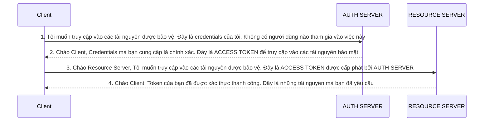
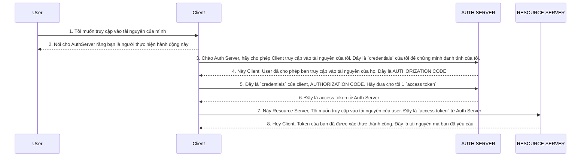

# Bảo mật (Security) trong Microservices
## 1. Giới thiệu
`Microservices` là một kiến trúc phần mềm mà ứng dụng được chia thành các dịch vụ nhỏ, độc lập, mỗi dịch vụ có thể được phát triển, triển khai và mở rộng một cách độc lập. Mỗi dịch vụ có thể được viết bằng ngôn ngữ lập trình khác nhau và có thể sử dụng công nghệ lưu trữ dữ liệu khác nhau. Mỗi dịch vụ có thể được triển khai trên một máy chủ hoặc một nhóm máy chủ riêng biệt.

Do trong `Microservices` mỗi dịch vụ là một ứng dụng độc lập, có thể lên đến hàng trăm hoặc hàng nghìn dịch vụ, nên việc quản lý bảo mật cho từng dịch vụ trở nên phức tạp hơn so với kiến trúc monolithic. Vì vậy việc cấu hình `bảo mật` trong từng `service` là không khả thi.

Để giải quyết vấn đề này, chúng ta cần một cơ chế bảo mật ở mức hệ thống, tập trung để quản lý và kiểm soát quyền truy cập của các dịch vụ. 

> Ví dụ: Hệ sinh thái `Google` sử dụng `OAuth2` để quản lý quyền truy cập giữa các dịch vụ. Các ứng dụng con như `Gmail`, `Google Drive`, `Google Calendar` sẽ sử dụng `OAuth2` để xác thực và truy cập dữ liệu từ ứng dụng cha là `Google Account`. Ứng dụng cha ko cần cấp `password` mà chỉ cần cung cấp các `token` và `thông tin cần thiết` cho các ứng dụng con, còn việc xác thực và quản lý quyền truy cập sẽ do `OAuth2` quản lý.

Một số cơ chế bảo mật phổ biến được sử dụng trong `Microservices` như `OAuth2/OpenID Connect`, `Keycloak` với Spring sẽ là `Spring Security`.

### 1.1. OAuth2
`Oauth` viết tắt của `Open Authorization` là một giao thức xác thực mở được thiết kế để cung cấp một cách cho ứng dụng truy cập vào dữ liệu của người dùng mà không cần biết `password`. `OAuth2` là phiên bản tiếp theo của `OAuth` với nhiều cải tiến và bổ sung.

Dưới đây là một số lợi ích của `OAuth2`:
- `Hỗ trợ tất cả các ứng dụng`: `OAuth2` hỗ trợ tất cả các ứng dụng, từ ứng dụng web, ứng dụng di động, ứng dụng desktop, ứng dụng IoT, ...
- `Tách biệt các logic xác thực`: Bên trong `OAuth2`, chúng ta có một `Authorization Server`, nó nhận các request từ client cho việc lấy `access token` và `phát hành` chúng nếu client được xác thực thành công. Điều này giúp chúng ta dễ dàng bảo trì tất cả `security logic` ở một nơi duy nhất. Tất cả `user credentials` và `application credentials` đều được lưu trữ ở một nơi duy nhất bên trong `Authorization Server`.
- `Không cần chia sẻ Credentials`: Nếu chúng ta cho phép dịch vụ thứ 3 truy cập vào tài nguyên của mình, thì sẽ không cần phải chia sẻ `credentials` với họ. Thay vào đó, chúng ta có thể cấp cho họ một `access token` mà họ có thể sử dụng để truy cập vào tài nguyên của mình.

**Các thuật ngữ trong OAuth2:**
- `Resource Owner`: Là người sở hữu tài nguyên, có thể là người dùng hoặc ứng dụng.
- `Client`: Là ứng dụng muốn truy cập vào tài nguyên của `Resource Owner`, ví dụ như ứng dụng di động, ứng dụng web, ...
- `Authorization Server`: Là server chịu trách nhiệm xác thực `Resource Owner` và cấp `access token` cho `Client`.
- `Resource Server`: Là server chứa tài nguyên mà `Client` muốn truy cập.
- `Scopes`: Là các quyền, phạm vi truy cập mà `Client` muốn truy cập từ `Resource Owner`.

### 1.2. OpenID Connect
`OpenID Connect` là một giao thức nằm ở trên của `Oauth2 Framework`. Trong khi `Oauth2` cung cấp `ủy quyền` thông qua `access token` chứa các phạm vi `scopes` thì `OpenID Connect` cung cấp `xác thực` thông qua `ID token` chứa một thông tin thiết lập mới và các `claims` cụ thể về danh tính của người dùng.

Với `ID token`, `OpenID Connect` cung cấp một cách để xác thực thông tin chi tiết về người dùng mà không cần phải chia sẻ `credentials` giữa các ứng dụng.

Xác nhận danh tính là chìa khóa truy cập bất kỳ dịch vụ nào cần xác thực người dùng. Cốt lõi ủy quyền hiện đại (authorization) chính là `Oauth2`, nhưng `Oauth2` lại thiếu phần `xác thực` người dùng. Việc triển khai `OpenID Connect` trên `Oauth2` sẽ hoàn thành chiến lực IAM (Identity and Access Management) - Quản lý danh tính và quyền truy cập.

`OpenID` thêm vào `Oauth2` những chi tiết sau:
1. `OIDC` tiêu chuẩn hóa các `phạm vi` (scopes) thành `openid`, `profile`, `email`, `address`, `phone`, `offline_access`, `roles`, ...
2. `ID Token` chứa thông tin về người dùng, được mã hóa bằng `JWT` (JSON Web Token).
3. `OIDC` cung cấp `UserInfo Endpoint` để truy cập thông tin người dùng. `UserInfo Endpoint` trả về thông tin người dùng dưới dạng `JSON` - `/userinfo`.

> ĐỂ TRIỂN KHAI `OAUTH2` VÀ `OPENID CONNECT` TRONG SPRING, CHÚNG TA SẼ SỬ DỤNG `KEYCLOAK`, NGOÀI RA CÒN CÓ `OKTA`, `AMAON Cognito`, HOẶC [`SPRING AUTHORIZATION SERVER`](https://spring.io/projects/spring-authorization-server) MỚI ĐƯỢC PHÁT TRIỂN BỞI SPRING.

### 1.3. Sơ đồ luồng hoạt động của OAuth2
Ví dụ trong `Microservices`, `Client` sẽ là người dùng muốn truy cập vào tài nguyên của `Microservices`. `Resource Server` sẽ là dịch vụ cung cấp tài nguyên (Chính là `GatewayServer`). `Authorization Server` sẽ là dịch vụ cung cấp `access token. Ta có sơ đồ hoạt động như sau:



## 2. Sử dụng `Keycloak` với Spring Security
`Keycloak` là một dịch vụ quản lý `Identity and Access Management` mã nguồn mở, cung cấp các chức năng như `Single Sign-On`, `Identity Brokering` và `Social Login`. `Keycloak` cung cấp một cách dễ dàng để bảo vệ các ứng dụng và dịch vụ của bạn với các chức năng `Identity Management` và `Access Management`.

`Keycloak` đóng vai trò như một `Authorization Server` trong `OAuth2` và `OpenID Connect`. Nó cung cấp các `access token` và `ID token` cho các ứng dụng của bạn. `Keycloak` cũng cung cấp một `Admin Console` để quản lý người dùng, roles, clients, ...

Tài liệu hướng dẫn [Keycloak](https://www.keycloak.org/guides)

### 2.1. Cài đặt `Keycloak` với Docker
Chúng ta sẽ chạy lệnh sau để sử dụng `image` của `Keycloak` trên `Docker`:

```bash
docker run -p 7080:8080 -e KEYCLOAK_ADMIN=admin -e KEYCLOAK_ADMIN_PASSWORD=admin quay.io/keycloak/keycloak:25.0.2 start-dev
```
Trong đó:
- `-p 7080:8080`: Map port `7080` của máy host với port `8080` của container.
- `KEYCLOAK_ADMIN=admin`: Tạo một `admin user` với `username` là `admin`.
- `KEYCLOAK_ADMIN_PASSWORD=admin`: `Password` của `admin user`.
- `quay.io/keycloak/keycloak:25.0.2`: `Image` của `Keycloak` và phiên bản `25.0.2`.
- `start-dev`: Chạy `Keycloak` ở chế độ `development`.

Sau khi chạy lệnh trên, truy cập vào `http://localhost:7080` để truy cập vào `Admin Console` của `Keycloak`. Đăng nhập với `username` và `password` đã tạo ở trên.

### 2.2. Các thuật ngữ trong `Keycloak`
- `Realm`: Là một không gian cách ly, mỗi `Realm` chứa các `users`, `roles`, `clients`, `mappers`, ... Một `Realm` có thể chứa nhiều `clients` và `users`. Mặc định, `Keycloak` sẽ tạo một `Realm` là `master`. Chúng ta có thể tạo thêm `Realm` mới vì mỗi `Realm` có thể tương đương với từng môi trường như `development`, `staging`, `production`, ...
- `Client`: Là ứng dụng muốn truy cập vào `Resource Server`. Mỗi `Client` sẽ có một `Client ID` và `Client Secret`. `Client ID` sẽ được sử dụng để xác thực `Client` với `Authorization Server`.
- `User`: Là người dùng của hệ thống, mỗi `User` sẽ có một `username` và `password`. `Keycloak` cung cấp một `Admin Console` để quản lý `users`, `roles`, `clients`, ...
- `Role`: Là quyền truy cập của `User` trong hệ thống. Mỗi `Role` sẽ được gán cho một `User` hoặc một `Client`. `Role` có thể được sử dụng để kiểm soát quyền truy cập của `User` hoặc `Client` vào các `Resource Server`.
- `Mapper`: Là một cách để ánh xạ thông tin từ `User` hoặc `Client` sang `access token` hoặc `ID token`. `Mapper` có thể được sử dụng để thêm thông tin như `roles`, `email`, `address`, `phone`, ... vào `token`.
- `Client Scope`: Là một tập hợp các `mappers` và `roles` mà `Client` có thể sử dụng. `Client Scope` có thể được sử dụng để cấu hình các `mappers` và `roles` một cách tổng quát cho nhiều `Client`.

### 2.3. Đăng ký `Client` với `Keycloak` sử dụng `OpenID Connect` qua `Admin Console`
1. Đăng nhập vào `Admin Console` của `Keycloak`.
2. Chọn `Clients` -> `Create Client` để tạo một `Client` mới.
    - Trong phần `General settings`:
        + `Client type`: Chọn `OpenID Connect`.
        + `Client ID`: Nhập `Client ID` của `Client`. Chúng ta có thể đặt tên cho `Client` theo ý muốn. Nhưng phải đảm bảo `Client ID` là duy nhất và sẽ sử dụng để xác thực `Client` với `Authorization Server`.
        + `Name` và `Description`: Nhập tên và mô tả cho `Client`.
    - Trong phần `Capacity config`:
        + `Client authentication`: Chọn `On` để bật chức năng xác thực `Client` với `Authorization Server`. Nếu tắt chức năng này, `Client` sẽ không cần `Client Secret` để xác thực với `Authorization Server`
        + `Authentication flow`: Chỉ chọn `Service accounts roles` để cho phép `client` xác thực đến `Keycloak` và sẽ nhận được `access token`. Trong chính sách của `Oauth2`, điều này cho phép hỗ trợ `Client Credentials Grant` cho `Client`.
3. Nhấn `Save` để lưu thông tin `Client`.
4. Sau khi tạo `Client` thành công, Tại `Client details` chúng ta chọn mục `Credentials` để lấy `Client Secret`. `Client Secret` sẽ được sử dụng để xác thực `Client` với `Authorization Server`. Để làm được điều này, phần `Client Authenticator` chọn `Client ID and Secret`.
> VD `Client ID`
```txt
WsXKcHYnGRdg0SpOYxQ1THn6lcsdPXdaWsXKcHYnGRdg0SpOYxQ1THn6lcsdPXda
```

### 2.4. Sử dụng `Endpoint` của `Keycloak` để xem các thông tin cấu hình của `OpenID`
1. Chúng ta chọn `Realm Settings` từ `Menu`, mục `Endpoints` chọn `OpenID Endpoint Configuration` để xem các thông tin cấu hình của `OpenID`.
> URL sẽ có dạng như sau:
```txt
http://localhost:7080/realms/master/.well-known/openid-configuration
```
Trong đó:
- `master`: Là `Realm` mà chúng ta đang sử dụng.

2. Khi truy cập vào `URL` trên, chúng ta sẽ nhận được một `JSON` chứa các thông tin cấu hình của `OpenID`. Trong đó:
- `issuer`: Là `URL` của `Authorization Server`.
- `authorization_endpoint`: Là `URL` để xác thực `User` và cấp `access token`.
- `token_endpoint`: Là `URL` để lấy `access token`.
- `introspection_endpoint`: Là `URL` để kiểm tra `access token`.
- `userinfo_endpoint`: Là `URL` để lấy thông tin của `User`.
- `end_session_endpoint`: Là `URL` để đăng xuất `User`.
- `jwks_uri`: Là `URL` để lấy `public key` của `Authorization Server`. `Public key` sẽ được sử dụng để xác thực `access token`. Sẽ dùng để kết hợp với `Spring Security` để xác thực `access token`
- `grant_types_supported`: Là các `grant types` được hỗ trợ bởi `Authorization Server`. Có thể là `authorization_code`, `implicit`, `password`, `client_credentials`, `refresh_token`. Trong bài viết này, dùng `client_credentials` để xác thực `Client` với `Authorization Server`.
- `scopes_supported`: Là các `scopes` được hỗ trợ bởi `Authorization Server`. `Scopes` sẽ được sử dụng để kiểm soát quyền truy cập của `Client` vào `Resource Server`. Khi `Client` yêu cầu `access token`, nó sẽ cung cấp `scopes` mà nó muốn truy cập.

### 2.5. Sử dụng `Postman` để lấy `access token` từ `Keycloak` cho `OpenID Connect`
Thực hiện `POST request` tới `URL` của `token_endpoint` để lấy `access token` từ `Keycloak`. 

Bổ sung các thông tin sau vào `Body` của `POST request`. Lưu ý, sử dụng `form-urlencoded` để gửi dữ liệu.
```yml
grant_type: client_credentials # Loại grant type sử dụng cho OpenID
client_id: {Client ID đã tạo}
client_secret: {Client Secret vừa copy sau khi tạo Client}
scope: openid email profile # Scopes mà Client muốn truy cập (Bắt buộc phải có `openid`, các scopes khác có thể thêm vào cách nhau bởi dấu cách)
```
Sau khi gửi `POST request`, chúng ta sẽ nhận được một `JSON` chứa `access token`, `id token`, ... từ `Keycloak`. Mặc định thời gian sống sẽ là 60 giây. Trong đó:
- `access_token`: Là `access token` được sử dụng để truy cập vào `Resource Server`.
- `id_token`: Là `ID token` chứa thông tin về `User`. `ID token` sẽ được sử dụng để xác thực `User` và lấy thông tin của `User` từ `Authorization Server`.

## 3. Sử dụng `Spring Security` làm việc với `Keycloak` (Gateway Server sẽ đóng vai trò như `Resource Server`)
### 3.1. Cài đặt dependences cho `Gateway Server`.
Để sử dụng `Spring Security` làm việc với `Keycloak`, chúng ta cần thêm 1 số dependencies sau vào `pom.xml`:
> 1. Spring Security
```xml
<dependency>
    <groupId>org.springframework.boot</groupId>
    <artifactId>spring-boot-starter-security</artifactId>
</dependency>
```
> 2. Spring Security OAuth2 Resource Server (Để biến `Gateway Server` thành `Resource Server`)
```xml
<dependency>
    <groupId>org.springframework.security</groupId>
    <artifactId>spring-security-oauth2-resource-server</artifactId>
</dependency>
```
> 3. Spring Security OAuth2 Jose (Để làm việc với `JWT`)
```xml
<dependency>
    <groupId>org.springframework.security</groupId>
    <artifactId>spring-security-oauth2-jose</artifactId>
</dependency>
```

### 3.2. Cấu hình `application.properties` cho `Gateway Server`
Để cấu hình `Gateway Server` làm việc với `Keycloak`, chúng ta cần thêm thông tin về chứng thực vào `application.properties`:
```yml
spring:
 security:
  oauth2:
   resourceserver:
    jwt:
     jwk-set-uri: http://localhost:7080/auth/realms/master/protocol/openid-connect/certs # URL để lấy public key từ Keycloak (jwks_uri)
```

### 3.3. Cấu hình `SecurityConfig` cho `Gateway Server`
Chúng ta cần tạo một `SecurityConfig` để cấu hình `Spring Security` làm việc với `Keycloak`. Trong `SecurityConfig`, chúng ta cần cấu hình `Resource Server` và `JWT`

> Lưu ý, vì `Gateway Server` chúng ta đang sử dụng `Reactive Webflux` nên cấu hình `Security Config` có sự khác nhau 1 chút so với `Restful API`.

> SecurityConfig.java
```java
...
@Configuration
@EnableWebFluxSecurity
public class SecurityConfig {
  @Bean
  public SecurityWebFilterChain securityWebFilterChain(ServerHttpSecurity http) throws Exception {
    return http.authorizeExchange(exchanges ->
        exchanges.pathMatchers(HttpMethod.GET).permitAll() // Cho phép tất cả các request GET không cần xác thực
            .pathMatchers("/didan/accounts/**").authenticated() // Các request đến /didan/accounts/** cần xác thực
            .pathMatchers("/didan/cards/**").authenticated() // Các request đến /didan/cards/** cần xác thực
            .pathMatchers("/didan/loans/**").authenticated()) // Các request đến /didan/loans/** cần xác thực
        .oauth2ResourceServer(oauth2 -> oauth2.jwt(Customizer.withDefaults())) // Sử dụng JWT để xác thực
        .csrf(csrf -> csrf.disable()) // Tắt CSRF, chỉ nên dùng với trình duyệt tham gia vào quá trình xác thực (Spring MVC)
        .build();
  }
}
```

SAU KHI CHẠY TẤT CẢ `SERVICE` MỖI KHI THỰC HIỆN CÁC REQUEST `POST`, `PUT`, ... CẦN PHẢI CÓ `ACCESS TOKEN` THÊM VÀO HEADER NHƯ SAU:
```txt
Authorization: Bearer {access_token}
```
ĐỂ LẤY `ACCESS TOKEN` CHÚNG TA CẦN THỰC HIỆN `POST REQUEST` TỚI `URL` CỦA `KEYCLOAK` VỚI `CLIENT ID`, `CLIENT SECRET`, `SCOPE` LÀ `openid email profile` NHƯ ĐÃ HƯỚNG DẪN TRONG PHẦN TRÊN.


### 3.4. Phân quyền truy cập cho `Gateway Server` sử dụng `Roles` của `Keycloak`.
#### 3.4.1. Tạo `Role` và gán cho `Client ID` trong `Keycloak`.
    - Từ Menu chính, chọn `Realm roles` -> `Create Role` để tạo một `Role` mới (nếu chưa có).
    - Từ Menu chính, chọn `Clients` -> Chọn `Client ID` muốn gán `Role`
    - Chọn tab `Service Account Roles` -> Chọn `Assigned Roles` -> `Filter by realm roles` -> Chọn `Role` muốn gán -> `Assign`.

> KHI `DECODED` `ACCESS TOKEN` RA CHÚNG TA SẼ THẤY `ROLES` ĐƯỢC GÁN CHO `CLIENT` TRONG `BODY` CỦA `JWT`.
```json
...
"realm_access": {
    "roles": [
      "default-roles-master",
      "ACCOUNTS",
      "offline_access",
      "uma_authorization"
    ]
  },
...
```
#### 3.4.2. Cấu hình `SecurityConfig` để phân quyền truy cập cho `Gateway Server`.
1. Trước hết để lấy thông tin `Roles` từ `JWT`, chúng ta cần tạo một `Class` để lấy thông tin `Roles` từ `JWT`. Sư dụng inteface `Converter` để chuyển đổi `JWT` thành `GrantedAuthority`. Và chúng ta phải biến `RoleName` trong `JWT` thành `ROLE_{RoleName}` để `Spring Security` hiểu được.
> KeycloakRoleConverter.java
```java
package com.didan.microservices.gatewaysever.config;

import java.util.ArrayList;
import java.util.Collection;
import java.util.List;
import java.util.Map;
import java.util.stream.Collectors;
import org.springframework.core.convert.converter.Converter;
import org.springframework.security.core.GrantedAuthority;
import org.springframework.security.core.authority.SimpleGrantedAuthority;
import org.springframework.security.oauth2.jwt.Jwt;

public class KeycloakRoleConverter implements Converter<Jwt, Collection<GrantedAuthority>> {

  @Override
  public Collection<GrantedAuthority> convert(Jwt source) {
    Map<String, Object> realmAccess = (Map<String, Object>) source.getClaims().get("realm_access"); // Lấy thông tin về các role từ claim realm_access trong body của JWT
    if (realmAccess == null || realmAccess.isEmpty()) { // Nếu không có role nào được trả về thì trả về một danh sách rỗng
      return new ArrayList<>();
    }
    Collection<GrantedAuthority> returnValue = ((List<String>) realmAccess.get("roles")) // Lấy danh sách các role từ realm_access.roles
        .stream() // Chuyển danh sách các role thành stream để thực hiện các thao tác tiếp theo
        .map(roleName -> "ROLE_" + roleName) // Thêm tiền tố ROLE_ vào tên của role
        .map(SimpleGrantedAuthority::new) // Chuyển tên của role thành một SimpleGrantedAuthority object
        .collect(Collectors.toList()); // Chuyển stream thành List
    return returnValue; // Trả về danh sách các role
  }
}
```
2. Tiếp theo, chúng ta cần cấu hình `SecurityConfig` để sử dụng `KeycloakRoleConverter` để lấy thông tin `Roles` từ `JWT`. Ngoài ra còn set `ROLE` cho từng `request` tới `Gateway Server`.
> SecurityConfig.java
```java
...
@Configuration
@EnableWebFluxSecurity

public class SecurityConfig {
  // Convert role từ claim realm_access trong JWT thành GrantedAuthority vào trong cấu hình oauth2.jwt
  // Vì là Reactive Webflux nên cần sử dụng ReactiveJwtAuthenticationConverterAdapter, và Mono
  private Converter<Jwt, Mono<AbstractAuthenticationToken>> grantedAuthoritiesExtractor() {
    JwtAuthenticationConverter jwtAuthenticationConverter = new JwtAuthenticationConverter();
    jwtAuthenticationConverter.setJwtGrantedAuthoritiesConverter(new KeycloakRoleConverter());
    return new ReactiveJwtAuthenticationConverterAdapter(jwtAuthenticationConverter);
  }

  @Bean
  public SecurityWebFilterChain securityWebFilterChain(ServerHttpSecurity http) throws Exception {
    return http.authorizeExchange(exchanges ->
        exchanges.pathMatchers(HttpMethod.GET).permitAll() // Cho phép tất cả các request GET không cần xác thực
            .pathMatchers("/didan/accounts/**").hasRole("ACCOUNTS") // Các request đến /didan/accounts/** cần xác thực và có role ACCOUNTS
            .pathMatchers("/didan/cards/**").hasRole("CARDS") // Các request đến /didan/cards/** cần xác thực và có role CARDS
            .pathMatchers("/didan/loans/**").hasRole("LOANS")) // Các request đến /didan/loans/** cần xác thực và có role LOANS
        .oauth2ResourceServer(oauth2 -> oauth2.jwt(jwt -> jwt.jwtDecoder(jwtDecoder()))) // Sử dụng JWT để xác thực
        .csrf(csrf -> csrf.disable()) // Tắt CSRF, chỉ nên dùng với trình duyệt tham gia vào quá trình xác thực (Spring MVC)
        .build();
  }
}
```
SAU KHI CẤU HÌNH XONG, KHI THỰC HIỆN CÁC `REQUEST` TỚI `Gateway Server` CHÚNG TA CẦN PHẢI CÓ `ACCESS TOKEN` VÀ `ROLE` CỦA `CLIENT` ĐƯỢC GÁN TRONG `JWT` ĐỂ CÓ THỂ TRUY CẬP VÀO CÁC `ENDPOINT` CỦA `Gateway Server`.


## 4. Bảo mật `Gateway Server` với `Authorization Code`.
`Authorization Code` là một trong những `grant types` của `OAuth2` được sử dụng để xác thực `User` và cấp `access token` cho `Client`. `Authorization Code` là một `grant type` an toàn và phổ biến nhất trong `OAuth2`.

`Authorization Code` sẽ tạo `2` request từ `Client` tới `Authorization Server` cho `authorization code` và `access token`.
- Trong bước đầu tiên, `Authorization Server` sẽ đảm bảo `user` tương tác trực tiếp với nó cùng với thông tin xác thực. `Authorization Server` sẽ cấp `authorization code` cho `Client`.
- Sau khi nhận được `authorization code`, `Client` phải chúng minh danh tính của mình cùng với `authorization code` và `credentials` của mình để lấy `access token`

> Sử dụng 2 bước này giúp tăng cường bảo mật cho hệ thống, vì `Client` không cần phải lưu trữ `credentials` của `User` và `access token` sẽ không bị lộ khi truyền qua `URL`.

### 4.1. Luồng hoạt động của `Authorization Code`
`User` là người sở hữu tài nguyên, muốn truy cập vào tài nguyên của mình thông qua `Client`.

`Client` là ứng dụng muốn truy cập vào tài nguyên của `User`, sẽ yêu cầu `Authorization Code` từ `Authorization Server` và sau đó sẽ yêu cầu `access token` từ `Authorization Server` thông qua `Authorization Code`.



Trong bước `2` & `3`, Chỗ mà `Client` thực hiện `request` tới `Authorization Server` cần phải gửi những thông tin sau:
- `client_id`: ID xác định `client application` bởi `Auth Server`. Điều này sẽ được cấp khi `client` đăng ký lần đầu tiên với `Auth Server`.
= `redirect_uri`: `giá trị URI` mà `Auth Server` cần để chuyển hướng sau khi xác thực thành công. Nếu giá trị mặc định được cung cấp trong quá trình đăng ký thì giá trị này là tùy chọn.
- `scope`: tương tự như `authorities`. Chỉ định mức độ truy cập mà khách hàng đang yêu cầu như `READ`.
- `state`: chính là`CSRF token` để bảo vệ khỏi các cuộc tấn công CSRF.
- `response_type`: loại phản hồi mà `client` muốn nhận từ `Auth Server`. Trong trường hợp này, nó sẽ là `code`. Cho biết tuân theo việc cấp `authorization code`.

Đến bước `5` sau khi nhận được `authorization code`, `Client` sẽ gửi `request` tới `Auth Server` với `authorization code` và `credentials` của mình để lấy `access token`. `Client` cần gửi những thông tin sau:
- `code`: `authorization code` mà `Client` nhận được từ `Auth Server`.
- `client_id` và `client_secret`: `credentials` của `Client` để xác thực với `Auth Server`. KHÔNG PHẢI LÀ `credentials` CỦA `User`.
- `grant_type`: loại `grant type` mà `Client` muốn sử dụng. Trong trường hợp này, nó sẽ là `authorization_code`. Để cho biết `Client` muốn sử dụng `authorization code` để lấy `access token`.
- `redirect_uri`: `URI` mà `Auth Server` cần để chuyển hướng sau khi xác thực thành công. Nếu giá trị mặc định được cung cấp trong quá trình đăng ký thì giá trị này là tùy chọn.