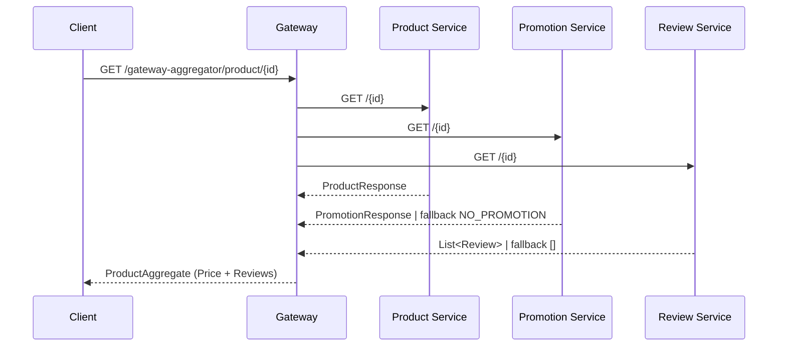
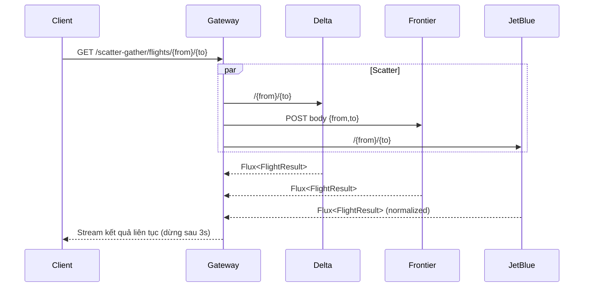
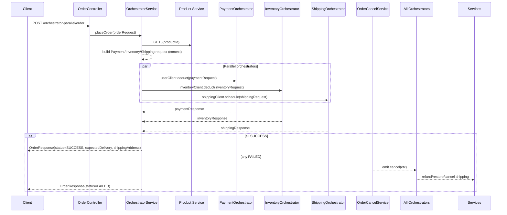
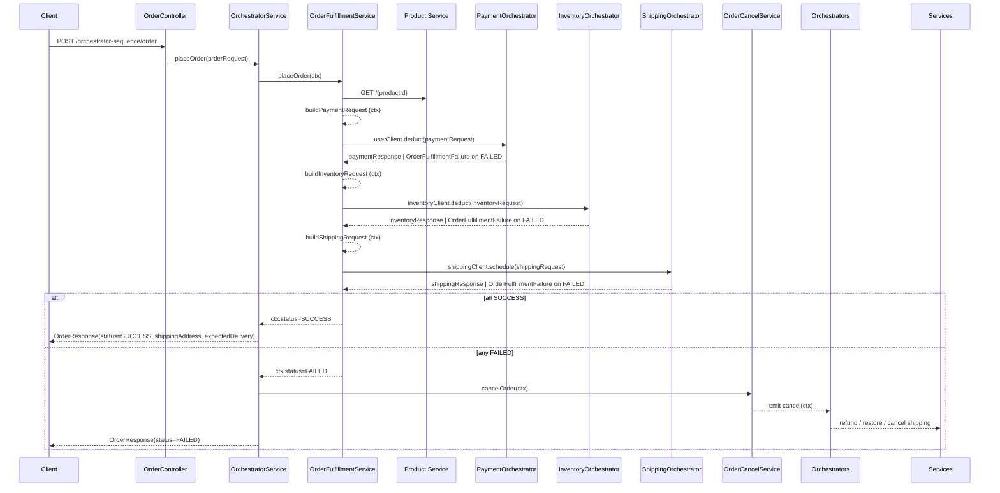
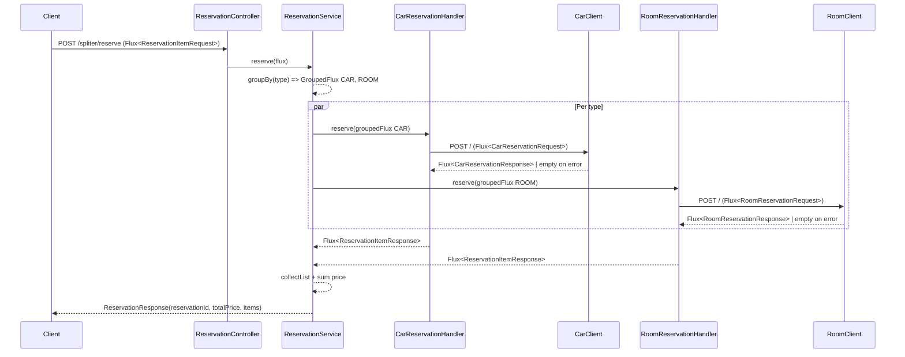
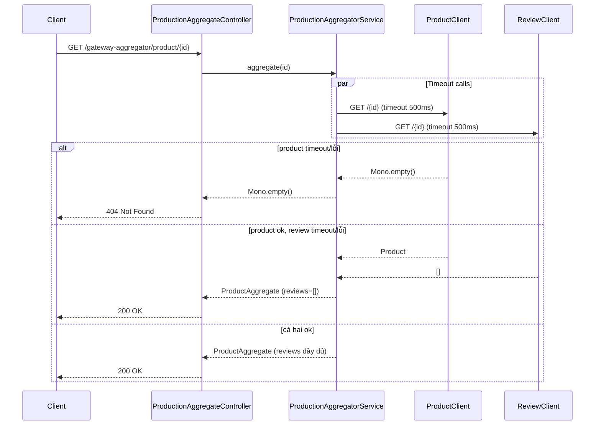
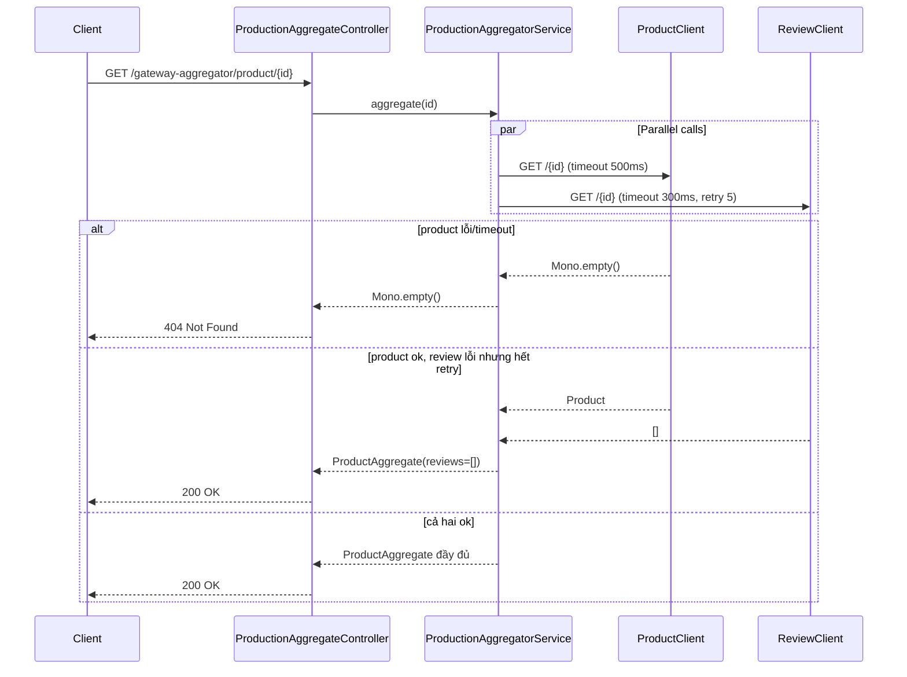
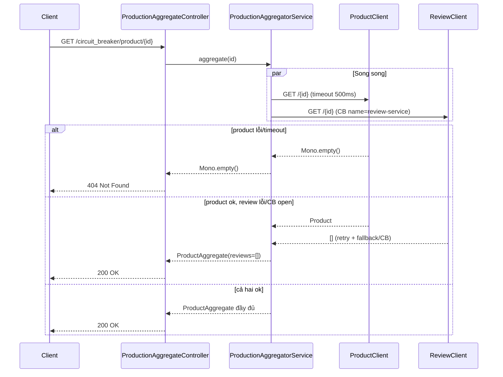

# Microservices Pattern

## 1. Gateway Aggregation Pattern
`Gateway Aggregation Pattern` là một mẫu thiết kế kiến trúc phần mềm trong đó một cổng (gateway) được sử dụng để tổng hợp các dịch vụ vi mô (microservices) khác nhau thành một điểm truy cập duy nhất cho người dùng hoặc ứng dụng khách. Mẫu này giúp đơn giản hóa việc tương tác với nhiều dịch vụ vi mô bằng cách cung cấp một giao diện duy nhất, giảm thiểu số lượng yêu cầu mà khách hàng phải gửi đến các dịch vụ riêng lẻ.

### 1.1 Kiến trúc tổng quan trong dự án
- `ProductionAggregateController` (`src/main/java/com/didan/pattern/microservices_pattern/gateway_aggregator/controller/ProductionAggregateController.java`) mở ra endpoint `GET /gateway-aggregator/product/{id}` làm điểm vào duy nhất cho client. Controller trả về `Mono<ResponseEntity<ProductAggregate>>` nên hỗ trợ luôn mô hình bất đồng bộ của WebFlux.
- `ProductionAggregatorService` chịu trách nhiệm gom dữ liệu. Phương thức `aggregate(Integer id)` dùng `Mono.zip(productClient.getProduct(id), promotionClient.getPromotion(id), reviewClient.getReviews(id))` để gọi song song 3 microservice (product, promotion, review) và chỉ trả về khi cả 3 kết thúc thành công.
- Các client (`ProductClient`, `PromotionClient`, `ReviewClient` trong package `com.didan.pattern.microservices_pattern.gateway_aggregator.client`) sử dụng `WebClient` với baseUrl cấu hình qua `gateway_aggregator.*.service`. Việc tạo WebClient một lần trong constructor giúp tái sử dụng kết nối HTTP.

### 1.2 Chi tiết xử lý và khả năng chống lỗi
1. **Product**: `ProductClient#getProduct` trả về `Mono<ProductResponse>` và `onErrorResume` thành `Mono.empty()`. Nếu microservice sản phẩm không phản hồi, `Mono.zip` sẽ không phát ra giá trị, khiến controller trả về `404 Not Found` (nhờ `defaultIfEmpty(ResponseEntity.notFound().build())`). Điều này đảm bảo không trả dữ liệu nửa vời cho client.
2. **Promotion**: `PromotionClient#getPromotion` dùng `onErrorReturn(noPromotion)` với `PromotionResponse` mặc định (`id=-1`, `type=NO_PROMOTION`, `discount=0`). Khi dịch vụ khuyến mãi lỗi, hệ thống vẫn trả về dữ liệu sản phẩm và review nhưng không áp dụng giảm giá, tránh làm fail toàn bộ request.
3. **Review**: `ReviewClient#getReviews` chuyển `bodyToFlux(Review.class)` thành `Mono<List<Review>>` rồi `onErrorReturn(Collections.emptyList())`. Khi dịch vụ review lỗi, client vẫn nhận được danh sách rỗng thay vì HTTP lỗi.

### 1.3 Dữ liệu tổng hợp
- `ProductAggregate` chứa: thông tin sản phẩm, đối tượng giá (`Price`) và danh sách review.
- `ProductionAggregatorService#toDto` tính toán các giá trị như `amountSaved`, `discountedPrice`, thời hạn khuyến mãi (`endDate`) dựa trên `ProductResponse` và `PromotionResponse`. Việc chuẩn hóa logic giá trong gateway giúp downstream client có cấu trúc dữ liệu thống nhất, không cần tự tính toán.

### 1.4 Luồng hoạt động


### 1.5 Ưu điểm và lưu ý
- **Giảm round-trip**: Client chỉ gọi một endpoint để lấy đầy đủ thông tin sản phẩm.
- **Tăng khả dụng**: Chiến lược fallback ở từng client giúp gateway vẫn trả kết quả hữu dụng khi một số dịch vụ phụ trợ gặp sự cố.
- **Song song hóa**: `Mono.zip` chạy song song các request giúp latency phụ thuộc vào service chậm nhất thay vì tổng thời gian.
- **Cần chuẩn hóa lỗi**: Vì `ProductClient` trả `Mono.empty()` khi lỗi, cần đảm bảo client hiểu rằng thiếu sản phẩm sẽ cho 404 để tránh nhầm lẫn với lỗi khác. Ngoài ra nên log chi tiết nguyên nhân lỗi ở từng client để dễ quan sát.

## 2. Scatter - Gather Pattern
`Scatter-Gather Pattern` là một mẫu thiết kế kiến trúc phần mềm trong đó một yêu cầu từ người dùng hoặc ứng dụng khách được phân tán (scatter) đến nhiều dịch vụ vi mô (microservices) khác nhau để xử lý song song, sau đó kết quả từ các dịch vụ này được thu thập (gather) và tổng hợp lại để trả về cho người dùng. Mẫu này giúp cải thiện hiệu suất và khả năng mở rộng của hệ thống bằng cách tận dụng khả năng xử lý song song của các dịch vụ vi mô.

Khác với `Gateway Aggregation Pattern`, trong `Scatter-Gather Pattern`, các dịch vụ vi mô có thể hoạt động độc lập và không cần thiết phải trả về dữ liệu tổng hợp từ một điểm trung tâm. Thay vào đó, mỗi dịch vụ có thể trả về kết quả riêng biệt, và ứng dụng khách hoặc một thành phần trung gian sẽ chịu trách nhiệm thu thập và xử lý các kết quả này.

Ứng dụng của `Scatter-Gather Pattern` trong các bài toán thực tế như:
- Tìm kiếm thông tin từ nhiều nguồn dữ liệu khác nhau và tổng hợp kết quả.
- Xử lý các tác vụ phức tạp bằng cách phân chia chúng thành các nhiệm vụ nhỏ hơn và xử lý song song.
- Thu thập dữ liệu từ nhiều dịch vụ vi mô để tạo báo cáo hoặc phân tích.

### 2.1 Bố cục thành phần trong dự án
- `FlightController` (`src/main/java/com/didan/pattern/microservices_pattern/scatter_gather/controller/FlightController.java`) cung cấp endpoint `GET /scatter-gather/flights/{from}/{to}` xuất dữ liệu kiểu `text/event-stream`. Client có thể tiêu thụ kết quả từng phần ngay khi một hãng trả dữ liệu.
- `FlightSearchService` (`scatter_gather.service`) là nơi gom dữ liệu. Phương thức `getFlights(from, to)` gọi `Flux.merge(deltaClient.getFlights(...), frontierClient.getFlights(...), jetBlueClient.getFlights(...))` để hủy bỏ tuần tự, chạy tất cả request cùng lúc.
- Ba client (`DeltaClient`, `FrontierClient`, `JetBlueClient` trong package `scatter_gather.client`) bao bọc cách gọi API của từng hãng. Mỗi client sử dụng `WebClient` riêng với baseUrl cấu hình qua `scatter_gather.*.service`.

### 2.2 Chiến lược bất đồng bộ và giới hạn thời gian
- `Flux.merge` đảm bảo kết quả của hãng nào về trước sẽ được đẩy tới client ngay, đúng tinh thần gather liên tục.
- `take(Duration.ofSeconds(3))` ở `FlightSearchService` dừng stream sau 3 giây (`FlightSearchService.java:18-25`). Điều này tránh để request treo quá lâu nếu một hãng phản hồi chậm hoặc server SSE không đóng kết nối.

### 2.3 Chuẩn hóa và fallback ở từng client
1. **Delta** (`DeltaClient.java`): gọi GET `{from}/{to}`, `bodyToFlux(FlightResult.class)` và `onErrorResume(ex -> Mono.empty())`. Khi gặp lỗi sẽ bỏ qua hãng Delta để không ảnh hưởng toàn bộ kết quả.
2. **Frontier** (`FrontierClient.java`): dùng POST với body `FrontierRequest.create(from, to)` để tương thích API khác biệt. Trả về Flux và cũng fallback sang `Mono.empty()`.
3. **JetBlue** (`JetBlueClient.java`): ngoài GET thông thường, còn `doOnNext(fr -> normalizeResponse(...))` để ép giá trị `from`, `to`, `airline` vào kết quả, vì dịch vụ JetBlue có thể trả thiếu. Việc chuẩn hóa tại gateway giúp frontend không phải xử lý đặc thù của từng hãng.

### 2.4 Luồng hoạt động


### 2.5 Lợi ích và lưu ý
- **Giảm thời gian chờ trung bình**: Client nhận được chuyến bay đầu tiên ngay khi có hãng phản hồi, không phải chờ hãng chậm nhất.
- **Cô lập lỗi**: Fallback `Mono.empty()` ở từng client giúp loại bỏ nguồn lỗi nhưng vẫn trả kết quả từ các hãng còn lại.
- **Kiểm soát tài nguyên**: `take(Duration.ofSeconds(3))` tránh giữ kết nối quá lâu khi API đối tác có vấn đề, giảm rủi ro rò rỉ tài nguyên.
- **Yêu cầu quan sát**: Vì luồng chạy song song và có timeout, nên bổ sung logging/metrics để biết hãng nào thường xuyên timeout để điều chỉnh cấu hình phù hợp.


## 3. Orchestrator Saga Pattern
`Orchestrator Saga Pattern` là một mẫu thiết kế kiến trúc phần mềm được sử dụng trong các hệ thống phân tán, đặc biệt là trong kiến trúc microservices. Mẫu này giúp quản lý các giao dịch phân tán (distributed transactions) bằng cách chia nhỏ một giao dịch lớn thành nhiều bước nhỏ hơn, mỗi bước được thực hiện bởi một dịch vụ vi mô riêng biệt. Orchestrator Saga chịu trách nhiệm điều phối các bước này và đảm bảo rằng toàn bộ giao dịch được hoàn thành thành công hoặc được hoàn tác (rollback) nếu có lỗi xảy ra trong quá trình thực hiện.

`Orchestrator` là thành phần trung tâm trong mẫu Orchestrator Saga, chịu trách nhiệm điều phối các bước của giao dịch phân tán. Nó theo dõi trạng thái của từng bước, quyết định khi nào thực hiện bước tiếp theo và xử lý các tình huống lỗi bằng cách gọi các hành động hoàn tác (compensating actions) khi cần thiết.

### 3.1 Distributed Transaction & Parallel Workflow Pattern
`Distributed Transaction` là một khái niệm liên quan đến việc quản lý các giao dịch mà các bước của nó được thực hiện trên nhiều dịch vụ vi mô khác nhau trong một hệ thống phân tán. Mục tiêu của distributed transaction là đảm bảo tính nhất quán và toàn vẹn dữ liệu trong toàn bộ hệ thống, ngay cả khi có sự cố xảy ra trong quá trình thực hiện giao dịch.

`Parallel Workflow` là một phần mở rộng của Orchestrator Saga, cho phép thực hiện các bước của giao dịch song song thay vì tuần tự. Điều này giúp cải thiện hiệu suất và giảm thời gian hoàn thành giao dịch bằng cách tận dụng khả năng xử lý đồng thời của các dịch vụ vi mô.

#### 3.1.1 Bố cục thành phần trong dự án
- `OrderController` (`src/main/java/com/didan/pattern/microservices_pattern/orchestrator_parallel/controller/OrderController.java`) cung cấp endpoint `POST /orchestrator-parallel/order` nhận `Mono<OrderRequest>` và ủy quyền cho `OrchestratorService`.
- `OrchestratorService` (`orchestrator_parallel.service`) giữ vai trò điều phối chính: lấy giá sản phẩm, build context, thực thi workflow song song và kích hoạt rollback nếu cần.
- `OrchestrationRequestContext` (`orchestrator_parallel.dto`) là state chung mang `orderId`, `OrderRequest`, `Payment/Inventory/Shipping Request & Response`, giá sản phẩm và trạng thái tổng `Status`.
- Ba orchestrator con `InventoryOrchestrator`, `PaymentOrchestrator`, `ShippingOrchestrator` kế thừa abstract `Orchestrator` để chuẩn hóa 3 hành vi: `create` (thực thi), `isSuccess` (đánh giá thành công), `cancel` (bù trừ/rollback).

#### 3.1.2 Chuẩn bị ngữ cảnh và yêu cầu
- `OrchestratorService#getProduct` gọi `ProductClient#getProduct` để lấy giá (`Product#getPrice`) và set vào context; nếu product service lỗi trả `Mono.empty()` khiến toàn bộ pipeline rỗng và controller trả `404`.
- `OrchestratorUtil.buildRequestContext` dựa trên giá và input của khách:
  - `PaymentRequest`: user trả `productPrice * quantity`, đính kèm `orderId` (tiền đề cho refund).
  - `InventoryRequest`: trừ tồn kho cho `productId` với `quantity` tương ứng.
  - `ShippingRequest`: lên lịch giao hàng cho `userId`, gắn `orderId` làm khóa tham chiếu.

#### 3.1.3 Thực thi song song và hợp nhất kết quả
- `OrderFulfillmentService#placeOrder` inject list các orchestrator và map mỗi cái thành `Mono<OrchestrationRequestContext>` qua `create(ctx)`.
- `Mono.zip(list, a -> a[0])` cho phép chạy tất cả orchestrator song song trên cùng một `ctx` và chỉ emit khi cả ba hoàn tất; không clone object nên các `doOnNext` trong từng orchestrator cập nhật chung vào context.
- `updateStatus` kiểm tra `isSuccess()` của từng orchestrator, nếu tất cả SUCCESS thì set `ctx.status = SUCCESS`, ngược lại FAILED. Quy tắc này biến mỗi dịch vụ thành một bước của distributed transaction song song.

#### 3.1.4 Các bước bù trừ/rollback
- Sau khi `orderFulfillmentService` trả về, `OrchestratorService#doOrderPostProcessing` kiểm tra `ctx.status`; nếu FAILED thì `OrderCancelService.cancelOrder(ctx)` sẽ phát sự kiện hủy.
- `OrderCancelService` khởi tạo `Sinks.many().multicast().onBackpressureBuffer()` và để từng orchestrator subscribe. Khi nhận event, mỗi orchestrator `cancel()` chạy trong reactor:
  - `PaymentOrchestrator`: nếu trước đó charge thành công thì gọi `UserClient#refund`.
  - `InventoryOrchestrator`: nếu đã trừ kho thành công thì gọi `InventoryClient#restore`.
  - `ShippingOrchestrator`: nếu đã schedule thành công thì gọi `ShippingClient#cancel`.
- Mỗi `cancel()` tự `subscribe()` để bù trừ không chặn luồng chính, đảm bảo tính eventually consistent cho distributed transaction.

#### 3.1.5 Chiến lược chịu lỗi tại từng dịch vụ con
- Các client (`InventoryClient`, `UserClient`, `ShippingClient`) đều `onErrorReturn(...)` với `Status.FAILED` để không ném lỗi làm vỡ pipeline, đồng thời cung cấp đủ dữ liệu cho `isSuccess()` đánh giá.
- `PaymentOrchestrator#create`, `InventoryOrchestrator#create`, `ShippingOrchestrator#create` dùng `doOnNext` để ghi response vào context rồi `thenReturn(ctx)`; nếu bất kỳ service trả FAILED thì `updateStatus` sẽ gắn trạng thái tổng FAILED, kích hoạt rollback.

#### 3.1.6 Luồng hoạt động


#### 3.1.7 Lưu ý thiết kế
- Parallel workflow phù hợp khi các bước độc lập dữ liệu đầu vào (payment, inventory, shipping chỉ cần `orderId`, `userId`, `productId`, `quantity`), tránh dependency chéo giữa bước này và bước kia.
- Fallback `onErrorReturn` giúp duy trì dòng chảy nhưng nên bổ sung log/metrics để quan sát tỉ lệ lỗi của từng dịch vụ, tránh che giấu sự cố.
- `Mono.zip` đợi đủ cả ba nhánh mới đánh giá kết quả; nếu muốn hoàn tất sớm khi có FAILED đầu tiên có thể chuyển sang `Mono.whenDelayError` hoặc gán timeout trên từng orchestrator để giảm độ trễ.

### 3.2 Distributed Transaction & Sequential Workflow Pattern
`Sequential Workflow` là một phần mở rộng của Orchestrator Saga, trong đó các bước của giao dịch được thực hiện theo thứ tự tuần tự thay vì song song. Mẫu này đảm bảo rằng mỗi bước phải hoàn thành thành công trước khi bước tiếp theo được thực hiện, giúp duy trì tính nhất quán và toàn vẹn dữ liệu trong các tình huống mà các bước có dependency chéo.

Ưu điểm của `Sequential Workflow` bao gồm:
- Dễ dàng quản lý luồng công việc: Mỗi bước được thực hiện theo thứ tự rõ ràng, giúp dễ dàng theo dõi và kiểm soát quá trình thực hiện giao dịch.
- Giảm thiểu xung đột dữ liệu: Khi các bước được thực hiện tuần tự, nguy cơ xung đột dữ liệu giữa các dịch vụ vi mô được giảm thiểu.
- Đơn giản hóa xử lý lỗi: Khi một bước thất bại, việc hoàn tác các bước trước đó trở nên dễ dàng hơn vì chỉ cần quay lại các bước đã hoàn thành

Nhược điểm của `Sequential Workflow` bao gồm:
- Tăng độ trễ: Vì các bước được thực hiện tuần tự, thời gian hoàn thành giao dịch có thể tăng lên so với việc thực hiện song song.

`Sequential Workflow` là biến thể của Orchestrator Saga khi các bước phụ thuộc chặt vào output của bước trước, buộc phải chạy tuần tự để truyền tham số (vd: paymentId dùng để gắn transaction id vào inventory; inventoryId dùng để đặt shipping). Trình tự thực thi ngắn gọn: Thanh toán → Trừ tồn kho → Lên lịch giao hàng; bất kỳ bước nào thất bại sẽ ngắt luồng, gắn trạng thái FAILED và kích hoạt rollback.

#### 3.2.1 Bố cục thành phần trong dự án
- `OrderController` (`src/main/java/com/didan/pattern/microservices_pattern/orchestrator_sequence/controller/OrderController.java`) mở endpoint `POST /orchestrator-sequence/order`, nhận `Mono<OrderRequest>` và trả `Mono<ResponseEntity<OrderResponse>>`.
- `OrchestratorService` (`orchestrator_sequence.service`) tiếp nhận request, gọi `OrderFulfillmentService` để thực thi tuần tự và `OrderCancelService` để phát sự kiện rollback khi thất bại.
- `OrderFulfillmentService` triển khai thứ tự các bước business; inject trực tiếp từng orchestrator con (`PaymentOrchestrator`, `InventoryOrchestrator`, `ShippingOrchestrator`) vì cần gọi lần lượt.
- `OrchestrationRequestContext` (`orchestrator_sequence.dto`) giữ state toàn bộ transaction: `orderId` (UUID), input, giá sản phẩm, request/response từng bước và `Status` cuối cùng.

#### 3.2.2 Chuẩn bị ngữ cảnh và yêu cầu
- `getProduct` trong `OrderFulfillmentService` gọi `ProductClient#getProduct`, lấy `Product#getPrice` và ghi vào context; nếu service sản phẩm lỗi sẽ trả `Mono.empty()` khiến pipeline dừng sớm.
- `OrchestratorUtil` xây dựng request sau từng bước thành công:
  - `buildPaymentRequest`: tính số tiền `productPrice * quantity`, gắn `orderId` để truy vết thanh toán.
  - `buildInventoryRequest`: cần `paymentResponse.paymentId` làm tham chiếu giao dịch khi trừ kho.
  - `buildShippingRequest`: cần `inventoryResponse.inventoryId` làm khóa reference khi lên lịch giao hàng.
=> Thứ tự build phản ánh dependency dữ liệu giữa các bước, lý do phải chạy tuần tự.

#### 3.2.3 Thực thi tuần tự và short-circuit khi lỗi
- Mỗi orchestrator con kế thừa `Orchestrator` và override `create` để gọi service tương ứng, `isSuccess` để đánh giá kết quả.
- `statusHandler()` (trong abstract `Orchestrator`) được gắn ở cuối mỗi `create(...).handle(...)`: nếu `isSuccess` trả true → `sink.next(ctx)` cho phép bước kế tiếp chạy; nếu false → ném `OrderFulfillmentFailure` để dừng chuỗi.
- `OrderFulfillmentService#placeOrder` nối chuỗi:
  1) Lấy giá sản phẩm → `buildPaymentRequest` → `PaymentOrchestrator.create`.
  2) Khi thanh toán OK: `buildInventoryRequest` → `InventoryOrchestrator.create`.
  3) Khi trừ kho OK: `buildShippingRequest` → `ShippingOrchestrator.create`.
  4) Nếu tất cả thành công: set `ctx.status = SUCCESS`; nếu có lỗi ở bất kỳ bước nào: `doOnError` set FAILED và `onErrorReturn(ctx)` để trả về context kèm trạng thái.

#### 3.2.4 Quy trình rollback (compensation)
- `OrchestratorService#doOrderPostProcessing` kiểm tra `ctx.status`; nếu FAILED thì gọi `OrderCancelService.cancelOrder(ctx)`.
- `OrderCancelService` tạo `Sinks.many().multicast().onBackpressureBuffer()` và đăng ký tất cả orchestrator. Khi nhận sự kiện cancel:
  - `PaymentOrchestrator.cancel`: nếu charge thành công thì `UserClient#refund`.
  - `InventoryOrchestrator.cancel`: nếu đã trừ kho thì `InventoryClient#restore`.
  - `ShippingOrchestrator.cancel`: nếu đã schedule thì `ShippingClient#cancel`.
- Việc `cancel()` tự `subscribe()` đảm bảo compensation chạy bất đồng bộ, trả client kết quả FAILED nhưng vẫn tiếp tục bù trừ nền.

#### 3.2.5 Chiến lược chịu lỗi ở từng bước
- Các client (`UserClient`, `InventoryClient`, `ShippingClient`) dùng `onErrorReturn(...)` trả response với `Status.FAILED` thay vì lỗi cứng, giúp `statusHandler` đọc được trạng thái và chủ động ngắt chuỗi.
- `OrderFulfillmentFailure` là RuntimeException trống dùng để short-circuit chuỗi reactive; exception không mang thêm dữ liệu vì mọi thông tin đã nằm trong context (request + response).
- `onErrorReturn(ctx)` ở cuối pipeline đảm bảo controller luôn có response (SUCCESS hoặc FAILED) thay vì HTTP lỗi, phù hợp với hợp đồng API Saga.

#### 3.2.6 Luồng hoạt động


#### 3.2.7 Lưu ý thiết kế
- Sequential workflow phù hợp khi output của bước trước là input bắt buộc cho bước sau; nếu dependency giảm, có thể nâng cấp một phần sang song song để rút ngắn thời gian.
- `handle(statusHandler())` giúp tách bạch logic check thành công với phần call service; tuy nhiên cần log nguyên nhân thất bại tại client/service để không mất dấu lỗi.
- Vì pipeline trả HTTP 200 với status FAILED, nên phía caller cần đọc `OrderResponse.status` để quyết định hiển thị/ retry thay vì dựa vào mã HTTP.

## 4. Splitter Pattern: Điều hướng bản tin đến nhiều dịch vụ vi mô
`Splitter Pattern` là một mẫu thiết kế kiến trúc phần mềm trong đó một bản tin hoặc yêu cầu từ người dùng hoặc ứng dụng khách được chia nhỏ (split) thành nhiều phần hoặc nhiệm vụ nhỏ hơn, sau đó được gửi đến các dịch vụ vi mô (microservices) khác nhau để xử lý. Mẫu này giúp cải thiện hiệu suất và khả năng mở rộng của hệ thống bằng cách phân phối công việc giữa các dịch vụ vi mô một cách hiệu quả.

Ngược với `Aggregator Pattern`, trong `Splitter Pattern`, các dịch vụ vi mô hoạt động độc lập và không cần thiết phải trả về dữ liệu tổng hợp từ một điểm trung tâm. Thay vào đó, mỗi dịch vụ có thể xử lý phần công việc của mình và trả về kết quả riêng biệt hoặc không trả về gì cả.

### 4.1 Bố cục thành phần trong dự án
- `ReservationController` (`src/main/java/com/didan/pattern/microservices_pattern/splitter/controller/ReservationController.java`) mở endpoint `POST /spliter/reserve` nhận `Flux<ReservationItemRequest>` (stream các hạng mục đặt chỗ mix CAR/ROOM).
- `ReservationService` chịu trách nhiệm split và route: tạo `Map<ReservationType, ReservationHandler>` từ danh sách bean handler, group input theo `ReservationType`, rồi ủy quyền cho handler tương ứng xử lý.
- Các handler cụ thể:
  - `CarReservationHandler` gọi `CarClient` để đặt xe.
  - `RoomReservationHandler` gọi `RoomClient` để đặt phòng.
- Client `CarClient`, `RoomClient` gói `WebClient` tới dịch vụ downstream (baseUrl cấu hình bằng `splitter.car.service` và `splitter.room.service`), có fallback `onErrorResume` thành `Mono.empty()` để cô lập lỗi từng dịch vụ.

### 4.2 Quy trình split và route
1. **Nhận và split**: `ReservationService#reserve` nhận `Flux<ReservationItemRequest>` và gọi `groupBy(ReservationItemRequest::getType)`. Đây là bước splitter, tách luồng thành các `GroupedFlux` theo `ReservationType` (CAR, ROOM).
2. **Định tuyến tới handler**: mỗi nhóm được chuyền vào `aggregator(GroupedFlux)`:
   - Lấy `ReservationType` bằng `groupedFlux.key()`.
   - Tìm handler tương ứng trong map (`map.get(type)`), sau đó gọi `handler.reserve(groupedFlux)`.
3. **Chuyển đổi và gọi downstream**: từng handler chuyển `ReservationItemRequest` sang request đặc thù (vd: `CarReservationRequest` với `pickup/drop`, `RoomReservationRequest` với `checkin/checkout`), dùng `transform(client::resever)` để gửi cả luồng cùng lúc tới service downstream và nhận lại `Flux<...Response>`.
4. **Chuẩn hóa kết quả**: handler map response sang `ReservationItemResponse` thống nhất gồm `itemId`, `type`, `city`, `from/to`, `price`.
5. **Gom kết quả**: tất cả item response được `collectList` và build `ReservationResponse` kèm `reservationId` ngẫu nhiên và tổng giá (`map(this::toResponse)`).

### 4.3 Chi tiết từng handler
- **CarReservationHandler** (`splitter.service`): `reserve` pipeline: map `ReservationItemRequest -> CarReservationRequest` → `transform(carClient::resever)` → map sang `ReservationItemResponse`. Lấy `pickup/drop` từ `from/to` gốc, giữ nguyên `category`, gán `type=CAR`.
- **RoomReservationHandler** (`splitter.service`): tương tự nhưng dùng `RoomReservationRequest` với `checkin/checkout`, gán `type=ROOM`.
- Cả hai handler đều kế thừa `ReservationHandler` để chuẩn hóa API (`getType`, `reserve`). Việc kế thừa giúp dễ thêm handler mới (vd: `FLIGHT`) chỉ bằng cách implement class mới và đăng ký bean.

### 4.4 Chuỗi xử lý end-to-end


### 4.5 Lưu ý thiết kế và mở rộng
- **Isolation lỗi**: `onErrorResume(Mono.empty())` ở cả hai client giúp loại bỏ nhánh lỗi nhưng vẫn tiếp tục xử lý các nhóm khác; nên log lỗi để không che giấu sự cố.
- **Backpressure**: dùng `Flux` end-to-end nên pipeline chịu backpressure tự nhiên; nếu downstream chậm có thể thêm `.limitRate` tại từng handler.
- **Mở rộng**: thêm dịch vụ mới chỉ cần tạo `XReservationHandler extends ReservationHandler` + `XClient`; Spring sẽ inject vào list và map tự cập nhật, không cần sửa `ReservationService`.
- **Đồng nhất dữ liệu**: `ReservationItemResponse` chuẩn hóa trường `from/to` cho cả car và room, giúp client tiêu thụ dễ dàng dù upstream khác nhau.

## 5. Resilience Patterns

### 5.1. Timeout Pattern
`Timeout Pattern` đặt giới hạn thời gian cho từng call đến microservice downstream để tránh treo request toàn cục. Khi một nhánh vượt quá timeout, hệ thống trả về fallback (rỗng) hoặc 404 thay vì chờ vô hạn.

#### 5.1.1 Bố cục thành phần trong dự án
- `ProductionAggregateController` (`src/main/java/com/didan/pattern/microservices_pattern/timeout/controller/ProductionAggregateController.java`) mở endpoint `GET /gateway-aggregator/product/{id}` trả `Mono<ResponseEntity<ProductAggregate>>`.
- `ProductionAggregatorService` dùng `Mono.zip(productClient.getProduct(id), reviewClient.getReviews(id))` để song song gọi 2 service và gom kết quả.
- `ProductClient` (`timeout.client`) gọi product service, đặt timeout 500ms và `onErrorResume` → `Mono.empty()`; nếu hết thời gian hoặc lỗi sẽ khiến `Mono.zip` không phát giá trị (controller trả 404).
- `ReviewClient` đặt timeout 500ms và `onErrorReturn(Collections.emptyList())`; khi hết thời gian sẽ trả danh sách review rỗng nhưng vẫn giữ kết quả product.

#### 5.1.2 Luồng xử lý và hành vi khi hết thời gian
1) Controller nhận `GET /gateway-aggregator/product/{id}` và gọi `productionAggregatorService.aggregate(id)`.
2) `Mono.zip` chạy song song product + review, tuân thủ timeout từng nhánh.
3) Nếu **product** timeout/lỗi → `Mono.empty()` làm `Mono.zip` hoàn thành rỗng ⇒ controller `defaultIfEmpty` trả `404 Not Found`.
4) Nếu **review** timeout/lỗi → trả `Collections.emptyList()`; `ProductAggregate` vẫn được trả về với review rỗng.
5) Khi cả hai thành công trong 500ms → trả `ProductAggregate` đầy đủ.

#### 5.1.3 Chi tiết timeout trên client
- `ProductClient#getProduct`:
  - `timeout(Duration.ofMillis(500))` hủy request nếu quá 500ms.
  - `onErrorResume(ex -> Mono.empty())` cô lập lỗi (timeout, 5xx, network) để không phá vỡ pipeline.
- `ReviewClient#getReviews`:
  - `timeout(Duration.ofMillis(500))` tương tự.
  - `onErrorReturn(Collections.emptyList())` trả fallback rỗng, đảm bảo `Mono.zip` vẫn phát giá trị.
- Cả hai WebClient được cấu hình bằng baseUrl từ `timeout.*.service`, có thể chỉnh thời gian bằng cấu hình để phù hợp SLA từng dịch vụ.

#### 5.1.4 Chuỗi hoạt động


#### 5.1.5 Lưu ý thiết kế
- **Fail-fast**: timeout ngắn (500ms) giúp giải phóng tài nguyên nhanh, tránh chặn toàn bộ request khi một service treo.
- **Fallback phân biệt**: product là dữ liệu bắt buộc nên khi timeout trả 404; review là dữ liệu bổ trợ nên fallback sang danh sách rỗng để giữ trải nghiệm.
- **Giám sát**: cần log/metrics cho sự kiện timeout ở từng client để điều chỉnh SLA hoặc circuit breaker nếu tỉ lệ timeout cao.
- **Điều chỉnh động**: có thể externalize timeout qua cấu hình để thay đổi theo môi trường (dev/stage/prod) mà không sửa code.

### 5.2. Retry Pattern
`Retry Pattern` tự động lặp lại lời gọi tới dịch vụ downstream khi gặp lỗi tạm thời (timeout, 5xx, network), giúp tăng xác suất thành công mà không yêu cầu client tự retry.

#### 5.2.1 Bố cục thành phần trong dự án
- `ProductionAggregateController` (`src/main/java/com/didan/pattern/microservices_pattern/retry/controller/ProductionAggregateController.java`) vẫn mở endpoint `GET /gateway-aggregator/product/{id}`.
- `ProductionAggregatorService` zip song song product + review (`Mono.zip(productClient.getProduct(id), reviewClient.getReviews(id))`) và map về `ProductAggregate`.
- `ProductClient` đặt `timeout(500ms)` và `onErrorResume(Mono.empty())` giống phiên bản timeout.
- `ReviewClient` là nơi áp dụng retry: thiết lập timeout 300ms, `retry(5)` và fallback `onErrorReturn(Collections.emptyList())`.

#### 5.2.2 Luồng xử lý và hành vi retry
1) Controller gọi `aggregate(id)` → `Mono.zip` chạy product và review song song.
2) Nhánh **product**: nếu timeout/lỗi → `Mono.empty()` khiến `Mono.zip` rỗng, controller trả `404`.
3) Nhánh **review**: mỗi lỗi (timeout, 5xx, network) được `retry(5)` (tối đa 6 lần tính cả lần đầu). Sau cùng nếu vẫn lỗi hoặc hết thời gian (300ms/lần) → trả `Collections.emptyList()`.
4) onStatus 4xx ở `ReviewClient` trả `Mono.empty()` (không ném lỗi) nên không kích hoạt retry, trả về danh sách review rỗng ngay.
5) Khi product thành công và review sau retry thành công → trả `ProductAggregate` đầy đủ.

#### 5.2.3 Chi tiết retry trên ReviewClient
- Chuỗi call: `retrieve() -> onStatus(HttpStatusCode::is4xxClientError, response -> Mono.empty()) -> bodyToFlux -> collectList -> retry(5) -> timeout(300ms) -> onErrorReturn(emptyList)`.
- Retry chỉ áp dụng cho lỗi phát sinh sau `collectList` (timeout, 5xx, network). 4xx không retry vì không phát sinh error.
- Timeout per attempt 300ms giữ request ngắn; tổng thời gian tệ nhất ~6 * 300ms (chưa tính backpressure).

#### 5.2.4 Chuỗi hoạt động


#### 5.2.5 Lưu ý thiết kế
- **Giới hạn retry**: `retry(5)` không có backoff, có thể gây burst khi dịch vụ đích down; cân nhắc `retryWhen` với backoff và jitter.
- **Phân loại lỗi**: onStatus 4xx bỏ qua retry để tránh lặp lại lỗi phía client; nên log/metrics để nhận biết 4xx vs 5xx.
- **Tổng thời gian**: với timeout 300ms và tối đa 6 lần, review nhánh có thể tốn ~1.8s; cần cân đối với SLA tổng thể của API.
- **Fallback**: giữ nguyên chiến lược fail-open cho review (trả danh sách rỗng) và fail-closed cho product (404) để không trả dữ liệu thiếu sản phẩm.

### 5.3. Circuit Breaker Pattern
`Circuit Breaker Pattern` bảo vệ hệ thống khỏi việc gọi liên tục đến một dịch vụ downstream đang gặp sự cố, bằng cách "ngắt mạch" các cuộc gọi đến dịch vụ đó sau một số lần lỗi nhất định. Khi mạch bị ngắt, các cuộc gọi tiếp theo sẽ ngay lập tức trả về lỗi hoặc fallback mà không cố gắng gọi dịch vụ bị lỗi. Sau một khoảng thời gian, circuit breaker sẽ cho phép một số cuộc gọi thử nghiệm để kiểm tra xem dịch vụ đã hồi phục hay chưa.

Ứng dụng của `Circuit Breaker Pattern` bao gồm:
- Ngăn chặn việc gọi liên tục đến một dịch vụ không ổn định, giúp giảm tải cho dịch vụ đó và tránh làm tắc nghẽn hệ thống.
- Cải thiện độ ổn định và khả năng phục hồi của hệ thống bằng cách cung cấp các cơ chế fallback khi dịch vụ bị lỗi.
- Giúp phát hiện sớm các vấn đề với dịch vụ downstream thông qua việc theo dõi tỷ lệ lỗi và thời gian phản hồi.

Thuật ngữ phổ biến liên quan đến Circuit Breaker bao gồm:
- **Closed State**: Trạng thái bình thường, nơi các cuộc gọi được phép đi qua.
- **Open State**: Trạng thái ngắt mạch, nơi các cuộc gọi bị chặn và trả về lỗi hoặc fallback ngay lập tức.
- **Half-Open State**: Trạng thái thử nghiệm, nơi một số cuộc gọi được phép đi qua để kiểm tra xem dịch vụ đã hồi phục hay chưa.

#### 5.3.1. Thư viện Resilience4j
`Resilience4j` là một thư viện Java cung cấp các công cụ để xây dựng các hệ thống chịu lỗi, bao gồm Circuit Breaker, Retry, Rate Limiter, Bulkhead, và Time Limiter. Thư viện này được thiết kế để dễ dàng tích hợp với các ứng dụng dựa trên Spring Boot và cung cấp các tính năng mạnh mẽ để cải thiện độ ổn định và khả năng phục hồi của hệ thống.

Để sử dụng Resilience4j trong dự án Spring Boot, bạn cần thêm dependency vào file `pom.xml` hoặc `build.gradle`, sau đó cấu hình các thành phần như Circuit Breaker trong file cấu hình ứng dụng (`application.yml` hoặc `application.properties`). Bạn cũng có thể sử dụng annotation như `@CircuitBreaker` để áp dụng Circuit Breaker cho các phương thức cụ thể trong dịch vụ của bạn.
```xml
<!--Resilience-->
<dependency>
  <groupId>io.github.resilience4j</groupId>
  <artifactId>resilience4j-spring-boot3</artifactId>
  <version>${resilience4j.version}</version>
</dependency>
<dependency>
  <groupId>io.github.resilience4j</groupId>
  <artifactId>resilience4j-reactor</artifactId>
  <version>${resilience4j.version}</version>
</dependency>
<dependency>
  <groupId>org.springframework.boot</groupId>
  <artifactId>spring-boot-starter-actuator</artifactId>
</dependency>
<dependency>
  <groupId>org.springframework.boot</groupId>
  <artifactId>spring-boot-starter-aop</artifactId>
  <version>3.5.6</version>
</dependency>
<dependency>
  <groupId>com.fasterxml.jackson.core</groupId>
  <artifactId>jackson-databind</artifactId>
</dependency>
```

#### 5.3.2. Cấu hình Circuit Breaker
Cấu hình Circuit Breaker trong `application.yml` để thiết lập các tham số như thời gian chờ, ngưỡng lỗi, và thời gian mở mạch.
```yaml
resilience4j.circuitbreaker:
  instances: # (Tên instance circuit breaker, chỗ này có thể đặt tên tùy ý, nếu muốn áp dụng cho tất cả service thì bỏ trống)
    reviewServiceCircuitBreaker:
      registerHealthIndicator: true # đăng ký health indicator để theo dõi trạng thái
      slidingWindowType: COUNT_BASED # loại cửa sổ trượt (COUNT_BASED hoặc TIME_BASED, cho COUNT_BASED thì dùng số cuộc gọi, TIME_BASED thì dùng khoảng thời gian)
      slidingWindowSize: 10 # kích thước cửa sổ trượt (số cuộc gọi hoặc khoảng thời gian tùy loại)
      minimumNumberOfCalls: 5 # số cuộc gọi tối thiểu để đánh giá tỷ lệ lỗi
      permittedNumberOfCallsInHalfOpenState: 3 # số cuộc gọi cho phép trong trạng thái half-open
      waitDurationInOpenState: 10s # thời gian chờ trong trạng thái open trước khi chuyển sang half-open
      failureRateThreshold: 50 # ngưỡng tỷ lệ lỗi để mở mạch
      eventConsumerBufferSize: 10 # kích thước bộ đệm sự kiện
      recordExceptions: # các ngoại lệ được ghi nhận để tính tỷ lệ lỗi
        - java.io.IOException
        - java.util.concurrent.TimeoutException
      ignoreExceptions: # các ngoại lệ bị bỏ qua không tính vào tỷ lệ lỗi
        - org.springframework.web.client.HttpClientErrorException$NotFound
```

#### 5.3.3 Cấu hình Bean CircuitBreakerCustomizer
Tạo bean `CircuitBreakerCustomizer` để tùy chỉnh cấu hình Circuit Breaker cho các client cụ thể.
```java
@Configuration
public class CircuitBreakerConfig {
    @Bean
    public CircuitBreakerCustomizer<ReactiveCircuitBreaker> reviewServiceCircuitBreakerCustomizer() {
        return circuitBreaker -> {
            if ("reviewServiceCircuitBreaker".equals(circuitBreaker.getName())) {
                CircuitBreakerConfig config = CircuitBreakerConfig.custom()
                        .failureRateThreshold(50) // Ngưỡng tỷ lệ lỗi để mở mạch
                        .slidingWindowType(CircuitBreakerConfig.SlidingWindowType.COUNT_BASED)
                        .slidingWindowSize(10) // Kích thước cửa sổ trượt
                        .minimumNumberOfCalls(5) // Số cuộc gọi tối thiểu để đánh giá tỷ lệ lỗi
                        .permittedNumberOfCallsInHalfOpenState(3) // Số cuộc gọi cho phép trong trạng thái half-open
                        .waitDurationInOpenState(Duration.ofSeconds(10)) // Thời gian chờ trong trạng thái open
                        .recordExceptions(IOException.class, TimeoutException.class) // Ngoại lệ được ghi nhận
                        .ignoreExceptions(HttpClientErrorException.NotFound.class) // Ngoại lệ bị bỏ qua
                        .build();
                circuitBreaker.getEventPublisher()
                        .onStateTransition(event -> {
                            // Log trạng thái chuyển đổi của Circuit Breaker
                            System.out.println("Circuit Breaker " + event.getCircuitBreakerName() +
                                    " changed state from " + event.getStateTransition().getFromState() +
                                    " to " + event.getStateTransition().getToState());
                        });
                circuitBreaker.configure(config);
            }
        };
    }
}
```

#### 5.3.4 Áp dụng Circuit Breaker trong ReviewClient
Sử dụng annotation `@CircuitBreaker` trong `ReviewClient` để áp dụng Circuit Breaker cho phương thức gọi dịch vụ review.
```java
@Component
public class ReviewClient {
    private final WebClient webClient;
    public ReviewClient(WebClient.Builder webClientBuilder,
                        @Value("${timeout.review.service}") String baseUrl) {
        this.webClient = webClientBuilder.baseUrl(baseUrl).build();
    }
    @CircuitBreaker(name = "reviewServiceCircuitBreaker", fallbackMethod = "fallbackReviews")
    public Mono<List<Review>> getReviews(String productId) {
        return webClient.get()
                .uri("/{id}/reviews", productId)
                .retrieve()
                .onStatus(HttpStatusCode::is4xxClientError, response -> Mono.empty())
                .bodyToFlux(Review.class)
                .collectList()
                .timeout(Duration.ofMillis(500));
    }
    private Mono<List<Review>> fallbackReviews(String productId, Throwable ex) {
        // Fallback trả về danh sách rỗng khi Circuit Breaker mở hoặc có lỗi
        return Mono.just(Collections.emptyList());
    }
}
```

#### 5.3.5. Cấu trúc các thành phần và luồng hoạt động
- **Controller**: `ProductionAggregateController` (`circuit_breaker.controller`) mở endpoint `GET /circuit_breaker/product/{id}`, trả `Mono<ResponseEntity<ProductAggregate>>` với fallback 404 khi aggregation rỗng.
- **Aggregator Service**: `ProductionAggregatorService.aggregate(id)` zip song song `productClient.getProduct(id)` + `reviewClient.getReviews(id)`; nếu product trả `Mono.empty()` → `Mono.zip` rỗng, controller trả 404; nếu review fallback rỗng thì vẫn trả `ProductAggregate` với review rỗng.
- **ProductClient**: WebClient baseUrl `circuit_breaker.product.service`, timeout 500ms, `onErrorResume(Mono.empty())`; đóng vai trò “trip” luồng nếu sản phẩm không lấy được.
- **ReviewClient**:
  - Đánh dấu `@CircuitBreaker(name = "review-service", fallbackMethod = "fallBackReview")`.
  - Pipeline: GET → `onStatus(4xx -> Mono.empty())` → `bodyToFlux` → `collectList` → `retry(5)` → `timeout(300ms)` → `onErrorReturn(emptyList)`.
  - Fallback `fallBackReview` trả `Mono.just(Collections.emptyList())` khi breaker mở hoặc khi retry/timeout thất bại.
- **CircuitBreakerConfig**: bean `CircuitBreakerConfigCustomizer` đặt `minimumNumberOfCalls(4)` cho instance `review-service` (cần ít nhất 4 call mới đánh giá tỷ lệ lỗi và có thể mở mạch).



**Lưu ý thiết kế**:
- Circuit breaker gắn ở review (dữ liệu bổ trợ) nên fallback rỗng, đảm bảo không đánh sập toàn bộ API.
- `retry(5)` không backoff dễ gây burst khi review down; cân nhắc `retryWhen` với backoff và chỉ cho retry khi breaker đang closed/half-open.
- `minimumNumberOfCalls(4)` tránh mở mạch do một vài lỗi lẻ; cần chỉnh theo lưu lượng thực tế và SLA.

### 5.4. Rate Limiter Pattern
`Rate Limiter Pattern` kiểm soát số lượng yêu cầu được gửi đến một dịch vụ trong một khoảng thời gian nhất định, giúp bảo vệ dịch vụ khỏi bị quá tải và đảm bảo tính ổn định của hệ thống. Mẫu này thường được sử dụng để giới hạn lưu lượng truy cập từ các client hoặc dịch vụ khác, ngăn chặn các cuộc tấn công từ chối dịch vụ (DDoS) và duy trì hiệu suất của dịch vụ.

`Server Rate Limiting` áp dụng giới hạn ở phía dịch vụ nhận yêu cầu:
- Giúp giới hạn lưu lượng yêu cầu được phục vụ bởi máy chủ.
- Bảo vệ tài nguyên hệ thống khỏi bị quá tải do số lượng lớn yêu cầu từ client.
- Rất quan trọng cho CPU intensive hoặc I/O intensive services.

`Client Rate Limiting` áp dụng giới hạn ở phía dịch vụ gửi yêu cầu:
- Giúp kiểm soát số lượng yêu cầu gửi đi từ client đến các dịch vụ downstream.
- Ngăn chặn việc gửi quá nhiều yêu cầu trong một khoảng thời gian ngắn,
- Để giảm cost/respect contract với dịch vụ bên ngoài (third-party API) (giảm thiểu phí vượt quá giới hạn sử dụng, như promt API của OpenAI).

#### 5.4.1 Distributed Rate Limiter
`Distributed Rate Limiter` là một giải pháp giới hạn tốc độ yêu cầu được triển khai trên nhiều nút hoặc dịch vụ trong một hệ thống phân tán. Điều này đảm bảo rằng giới hạn tốc độ được áp dụng đồng nhất trên toàn bộ hệ thống, ngay cả khi các dịch vụ chạy trên các máy chủ khác nhau hoặc trong các môi trường đám mây khác nhau.

Một trong những cách phổ biến để triển khai Distributed Rate Limiter là sử dụng các công cụ lưu trữ dữ liệu phân tán như Redis hoặc Memcached để theo dõi số lượng yêu cầu từ các client trong một khoảng thời gian nhất định. Mỗi khi một yêu cầu được gửi đến, hệ thống sẽ kiểm tra số lượng yêu cầu đã được gửi từ client đó trong khoảng thời gian đã định và quyết định xem có cho phép yêu cầu đó tiếp tục hay không dựa trên giới hạn tốc độ đã thiết lập.

Ứng dụng của Distributed Rate Limiter bao gồm:
- Bảo vệ các dịch vụ khỏi bị quá tải do số lượng lớn yêu cầu từ nhiều client khác nhau.
- Đảm bảo tính ổn định và hiệu suất của hệ thống trong môi trường phân tán.
- Giúp tuân thủ các hợp đồng dịch vụ với các nhà cung cấp dịch vụ bên ngoài bằng cách kiểm soát lưu lượng yêu cầu gửi đến họ.
- Phân chia loại khách hàng (vd: free vs premium) với các giới hạn tốc độ khác nhau.