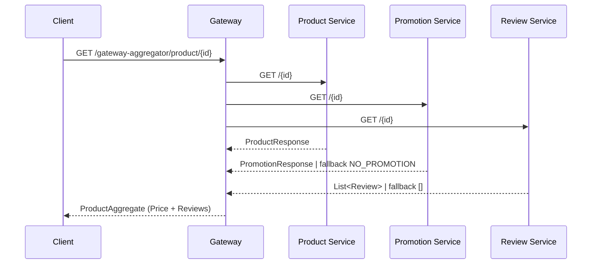

# Microservices Pattern

## 1. Gateway Aggregation Pattern
`Gateway Aggregation Pattern` là một mẫu thiết kế kiến trúc phần mềm trong đó một cổng (gateway) được sử dụng để tổng hợp các dịch vụ vi mô (microservices) khác nhau thành một điểm truy cập duy nhất cho người dùng hoặc ứng dụng khách. Mẫu này giúp đơn giản hóa việc tương tác với nhiều dịch vụ vi mô bằng cách cung cấp một giao diện duy nhất, giảm thiểu số lượng yêu cầu mà khách hàng phải gửi đến các dịch vụ riêng lẻ.

### 1.1 Kiến trúc tổng quan trong dự án
- `ProductionAggregateController` (`src/main/java/com/didan/pattern/microservices_pattern/gateway_aggregator/controller/ProductionAggregateController.java`) mở ra endpoint `GET /gateway-aggregator/product/{id}` làm điểm vào duy nhất cho client. Controller trả về `Mono<ResponseEntity<ProductAggregate>>` nên hỗ trợ luôn mô hình bất đồng bộ của WebFlux.
- `ProductionAggregatorService` chịu trách nhiệm gom dữ liệu. Phương thức `aggregate(Integer id)` dùng `Mono.zip(productClient.getProduct(id), promotionClient.getPromotion(id), reviewClient.getReviews(id))` để gọi song song 3 microservice (product, promotion, review) và chỉ trả về khi cả 3 kết thúc thành công.
- Các client (`ProductClient`, `PromotionClient`, `ReviewClient` trong package `com.didan.pattern.microservices_pattern.gateway_aggregator.client`) sử dụng `WebClient` với baseUrl cấu hình qua `gateway_aggregator.*.service`. Việc tạo WebClient một lần trong constructor giúp tái sử dụng kết nối HTTP.

### 1.2 Chi tiết xử lý và khả năng chống lỗi
1. **Product**: `ProductClient#getProduct` trả về `Mono<ProductResponse>` và `onErrorResume` thành `Mono.empty()`. Nếu microservice sản phẩm không phản hồi, `Mono.zip` sẽ không phát ra giá trị, khiến controller trả về `404 Not Found` (nhờ `defaultIfEmpty(ResponseEntity.notFound().build())`). Điều này đảm bảo không trả dữ liệu nửa vời cho client.
2. **Promotion**: `PromotionClient#getPromotion` dùng `onErrorReturn(noPromotion)` với `PromotionResponse` mặc định (`id=-1`, `type=NO_PROMOTION`, `discount=0`). Khi dịch vụ khuyến mãi lỗi, hệ thống vẫn trả về dữ liệu sản phẩm và review nhưng không áp dụng giảm giá, tránh làm fail toàn bộ request.
3. **Review**: `ReviewClient#getReviews` chuyển `bodyToFlux(Review.class)` thành `Mono<List<Review>>` rồi `onErrorReturn(Collections.emptyList())`. Khi dịch vụ review lỗi, client vẫn nhận được danh sách rỗng thay vì HTTP lỗi.

### 1.3 Dữ liệu tổng hợp
- `ProductAggregate` chứa: thông tin sản phẩm, đối tượng giá (`Price`) và danh sách review.
- `ProductionAggregatorService#toDto` tính toán các giá trị như `amountSaved`, `discountedPrice`, thời hạn khuyến mãi (`endDate`) dựa trên `ProductResponse` và `PromotionResponse`. Việc chuẩn hóa logic giá trong gateway giúp downstream client có cấu trúc dữ liệu thống nhất, không cần tự tính toán.

### 1.4 Luồng hoạt động

### 1.5 Ưu điểm và lưu ý
- **Giảm round-trip**: Client chỉ gọi một endpoint để lấy đầy đủ thông tin sản phẩm.
- **Tăng khả dụng**: Chiến lược fallback ở từng client giúp gateway vẫn trả kết quả hữu dụng khi một số dịch vụ phụ trợ gặp sự cố.
- **Song song hóa**: `Mono.zip` chạy song song các request giúp latency phụ thuộc vào service chậm nhất thay vì tổng thời gian.
- **Cần chuẩn hóa lỗi**: Vì `ProductClient` trả `Mono.empty()` khi lỗi, cần đảm bảo client hiểu rằng thiếu sản phẩm sẽ cho 404 để tránh nhầm lẫn với lỗi khác. Ngoài ra nên log chi tiết nguyên nhân lỗi ở từng client để dễ quan sát.
