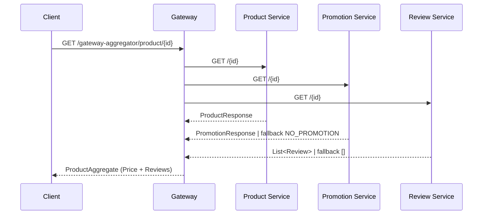
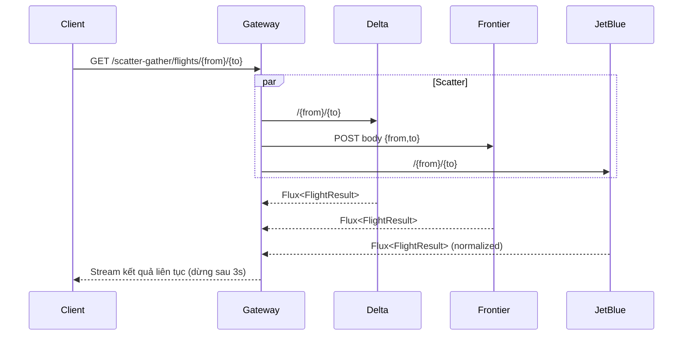

# Microservices Pattern

## 1. Gateway Aggregation Pattern
`Gateway Aggregation Pattern` là một mẫu thiết kế kiến trúc phần mềm trong đó một cổng (gateway) được sử dụng để tổng hợp các dịch vụ vi mô (microservices) khác nhau thành một điểm truy cập duy nhất cho người dùng hoặc ứng dụng khách. Mẫu này giúp đơn giản hóa việc tương tác với nhiều dịch vụ vi mô bằng cách cung cấp một giao diện duy nhất, giảm thiểu số lượng yêu cầu mà khách hàng phải gửi đến các dịch vụ riêng lẻ.

### 1.1 Kiến trúc tổng quan trong dự án
- `ProductionAggregateController` (`src/main/java/com/didan/pattern/microservices_pattern/gateway_aggregator/controller/ProductionAggregateController.java`) mở ra endpoint `GET /gateway-aggregator/product/{id}` làm điểm vào duy nhất cho client. Controller trả về `Mono<ResponseEntity<ProductAggregate>>` nên hỗ trợ luôn mô hình bất đồng bộ của WebFlux.
- `ProductionAggregatorService` chịu trách nhiệm gom dữ liệu. Phương thức `aggregate(Integer id)` dùng `Mono.zip(productClient.getProduct(id), promotionClient.getPromotion(id), reviewClient.getReviews(id))` để gọi song song 3 microservice (product, promotion, review) và chỉ trả về khi cả 3 kết thúc thành công.
- Các client (`ProductClient`, `PromotionClient`, `ReviewClient` trong package `com.didan.pattern.microservices_pattern.gateway_aggregator.client`) sử dụng `WebClient` với baseUrl cấu hình qua `gateway_aggregator.*.service`. Việc tạo WebClient một lần trong constructor giúp tái sử dụng kết nối HTTP.

### 1.2 Chi tiết xử lý và khả năng chống lỗi
1. **Product**: `ProductClient#getProduct` trả về `Mono<ProductResponse>` và `onErrorResume` thành `Mono.empty()`. Nếu microservice sản phẩm không phản hồi, `Mono.zip` sẽ không phát ra giá trị, khiến controller trả về `404 Not Found` (nhờ `defaultIfEmpty(ResponseEntity.notFound().build())`). Điều này đảm bảo không trả dữ liệu nửa vời cho client.
2. **Promotion**: `PromotionClient#getPromotion` dùng `onErrorReturn(noPromotion)` với `PromotionResponse` mặc định (`id=-1`, `type=NO_PROMOTION`, `discount=0`). Khi dịch vụ khuyến mãi lỗi, hệ thống vẫn trả về dữ liệu sản phẩm và review nhưng không áp dụng giảm giá, tránh làm fail toàn bộ request.
3. **Review**: `ReviewClient#getReviews` chuyển `bodyToFlux(Review.class)` thành `Mono<List<Review>>` rồi `onErrorReturn(Collections.emptyList())`. Khi dịch vụ review lỗi, client vẫn nhận được danh sách rỗng thay vì HTTP lỗi.

### 1.3 Dữ liệu tổng hợp
- `ProductAggregate` chứa: thông tin sản phẩm, đối tượng giá (`Price`) và danh sách review.
- `ProductionAggregatorService#toDto` tính toán các giá trị như `amountSaved`, `discountedPrice`, thời hạn khuyến mãi (`endDate`) dựa trên `ProductResponse` và `PromotionResponse`. Việc chuẩn hóa logic giá trong gateway giúp downstream client có cấu trúc dữ liệu thống nhất, không cần tự tính toán.

### 1.4 Luồng hoạt động

### 1.5 Ưu điểm và lưu ý
- **Giảm round-trip**: Client chỉ gọi một endpoint để lấy đầy đủ thông tin sản phẩm.
- **Tăng khả dụng**: Chiến lược fallback ở từng client giúp gateway vẫn trả kết quả hữu dụng khi một số dịch vụ phụ trợ gặp sự cố.
- **Song song hóa**: `Mono.zip` chạy song song các request giúp latency phụ thuộc vào service chậm nhất thay vì tổng thời gian.
- **Cần chuẩn hóa lỗi**: Vì `ProductClient` trả `Mono.empty()` khi lỗi, cần đảm bảo client hiểu rằng thiếu sản phẩm sẽ cho 404 để tránh nhầm lẫn với lỗi khác. Ngoài ra nên log chi tiết nguyên nhân lỗi ở từng client để dễ quan sát.

## 2. Scatter - Gather Pattern
`Scatter-Gather Pattern` là một mẫu thiết kế kiến trúc phần mềm trong đó một yêu cầu từ người dùng hoặc ứng dụng khách được phân tán (scatter) đến nhiều dịch vụ vi mô (microservices) khác nhau để xử lý song song, sau đó kết quả từ các dịch vụ này được thu thập (gather) và tổng hợp lại để trả về cho người dùng. Mẫu này giúp cải thiện hiệu suất và khả năng mở rộng của hệ thống bằng cách tận dụng khả năng xử lý song song của các dịch vụ vi mô.

Khác với `Gateway Aggregation Pattern`, trong `Scatter-Gather Pattern`, các dịch vụ vi mô có thể hoạt động độc lập và không cần thiết phải trả về dữ liệu tổng hợp từ một điểm trung tâm. Thay vào đó, mỗi dịch vụ có thể trả về kết quả riêng biệt, và ứng dụng khách hoặc một thành phần trung gian sẽ chịu trách nhiệm thu thập và xử lý các kết quả này.

Ứng dụng của `Scatter-Gather Pattern` trong các bài toán thực tế như:
- Tìm kiếm thông tin từ nhiều nguồn dữ liệu khác nhau và tổng hợp kết quả.
- Xử lý các tác vụ phức tạp bằng cách phân chia chúng thành các nhiệm vụ nhỏ hơn và xử lý song song.
- Thu thập dữ liệu từ nhiều dịch vụ vi mô để tạo báo cáo hoặc phân tích.

### 2.1 Bố cục thành phần trong dự án
- `FlightController` (`src/main/java/com/didan/pattern/microservices_pattern/scatter_gather/controller/FlightController.java`) cung cấp endpoint `GET /scatter-gather/flights/{from}/{to}` xuất dữ liệu kiểu `text/event-stream`. Client có thể tiêu thụ kết quả từng phần ngay khi một hãng trả dữ liệu.
- `FlightSearchService` (`scatter_gather.service`) là nơi gom dữ liệu. Phương thức `getFlights(from, to)` gọi `Flux.merge(deltaClient.getFlights(...), frontierClient.getFlights(...), jetBlueClient.getFlights(...))` để hủy bỏ tuần tự, chạy tất cả request cùng lúc.
- Ba client (`DeltaClient`, `FrontierClient`, `JetBlueClient` trong package `scatter_gather.client`) bao bọc cách gọi API của từng hãng. Mỗi client sử dụng `WebClient` riêng với baseUrl cấu hình qua `scatter_gather.*.service`.

### 2.2 Chiến lược bất đồng bộ và giới hạn thời gian
- `Flux.merge` đảm bảo kết quả của hãng nào về trước sẽ được đẩy tới client ngay, đúng tinh thần gather liên tục.
- `take(Duration.ofSeconds(3))` ở `FlightSearchService` dừng stream sau 3 giây (`FlightSearchService.java:18-25`). Điều này tránh để request treo quá lâu nếu một hãng phản hồi chậm hoặc server SSE không đóng kết nối.

### 2.3 Chuẩn hóa và fallback ở từng client
1. **Delta** (`DeltaClient.java`): gọi GET `{from}/{to}`, `bodyToFlux(FlightResult.class)` và `onErrorResume(ex -> Mono.empty())`. Khi gặp lỗi sẽ bỏ qua hãng Delta để không ảnh hưởng toàn bộ kết quả.
2. **Frontier** (`FrontierClient.java`): dùng POST với body `FrontierRequest.create(from, to)` để tương thích API khác biệt. Trả về Flux và cũng fallback sang `Mono.empty()`.
3. **JetBlue** (`JetBlueClient.java`): ngoài GET thông thường, còn `doOnNext(fr -> normalizeResponse(...))` để ép giá trị `from`, `to`, `airline` vào kết quả, vì dịch vụ JetBlue có thể trả thiếu. Việc chuẩn hóa tại gateway giúp frontend không phải xử lý đặc thù của từng hãng.

### 2.4 Luồng hoạt động

### 2.5 Lợi ích và lưu ý
- **Giảm thời gian chờ trung bình**: Client nhận được chuyến bay đầu tiên ngay khi có hãng phản hồi, không phải chờ hãng chậm nhất.
- **Cô lập lỗi**: Fallback `Mono.empty()` ở từng client giúp loại bỏ nguồn lỗi nhưng vẫn trả kết quả từ các hãng còn lại.
- **Kiểm soát tài nguyên**: `take(Duration.ofSeconds(3))` tránh giữ kết nối quá lâu khi API đối tác có vấn đề, giảm rủi ro rò rỉ tài nguyên.
- **Yêu cầu quan sát**: Vì luồng chạy song song và có timeout, nên bổ sung logging/metrics để biết hãng nào thường xuyên timeout để điều chỉnh cấu hình phù hợp.
