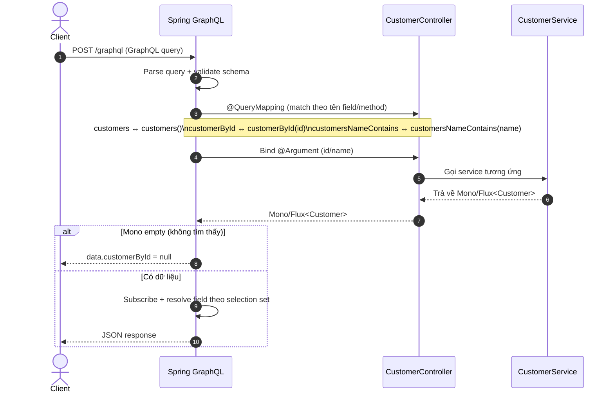

# Spring GraphQL
## 1. Giới thiệu
Spring GraphQL là một phần mở rộng của Spring Framework giúp xây dựng các dịch vụ GraphQL một cách dễ dàng và hiệu quả. Nó cung cấp các công cụ và tiện ích để xử lý các truy vấn GraphQL, định nghĩa schema, và tích hợp với các thành phần khác của Spring

GraphQL hỗ trợ cả lập trình đồng bộ và phản ứng, cho phép bạn xây dựng các ứng dụng web hiện đại với hiệu suất cao.

GraphQL là một ngôn ngữ truy vấn API mạnh mẽ, cho phép khách hàng yêu cầu chính xác những gì họ cần từ máy chủ. Điều này giúp giảm thiểu việc truyền tải dữ liệu không cần thiết và cải thiện hiệu suất của ứng dụng.

## 2. GraphQL Types
GraphQL định nghĩa một số loại dữ liệu cơ bản, bao gồm:
### 2.1. Scalar Types
Các loại dữ liệu nguyên thủy bao gồm:
- **Int**: Số nguyên 32-bit có dấu.
- **Float**: Số dấu phẩy động 64-bit.
- **String**: Chuỗi ký tự UTF-8.
- **Boolean**: Giá trị đúng hoặc sai.
- **ID**: Một định danh duy nhất, thường được sử dụng để tham chiếu đến các đối tượng. ID được biểu diễn dưới dạng chuỗi, bất kể giá trị thực tế là gì cũng sẽ được serialize thành chuỗi.

Ví dụ:
```graphql
type User {
    id: ID!
    name: String!
    age: Int
    isActive: Boolean!
}
```
> Lưu ý: Dấu chấm than (!) sau kiểu dữ liệu biểu thị rằng trường đó không thể có giá trị null.

### 2.2. Collection Types
- **List**: Đại diện cho một danh sách các giá trị của cùng một kiểu. Ví dụ: `[Int]` là một danh sách các số nguyên.
- **Non-Null**: Đảm bảo rằng một trường không thể có giá trị null. Ví dụ: `String!` biểu thị rằng trường đó phải luôn có một giá trị chuỗi.

Ví dụ:
```graphql
type Post {
    id: ID!
    title: String!
    tags: [String!]!  # Danh sách các chuỗi không null, và danh sách này cũng không thể null
}
```

### 2.3. Custom Types/Object Types
Ngoài các loại dữ liệu nguyên thủy, GraphQL cho phép bạn định nghĩa các loại dữ liệu tùy chỉnh (custom types) để mô hình hóa các đối tượng phức tạp hơn. Các loại này được gọi là Object Types và có thể bao gồm các trường với các kiểu dữ liệu khác nhau.

Ví dụ:
```graphql
type Author {
    id: ID!
    name: String!
    posts: [Post!]!
}

type Post {
    id: ID!
    title: String!
    content: String!
}
```
> Trong ví dụ trên, `Author` và `Post` là các Object Types với các trường dữ liệu khác nhau. `Author` có một trường `posts` là một danh sách các đối tượng `Post`.

### 2.4. Enum Types
Enum Types cho phép bạn định nghĩa một tập hợp các giá trị hằng số. Điều này hữu ích khi bạn muốn giới hạn giá trị của một trường chỉ trong một số lựa chọn cụ thể
Ví dụ:
```graphql
enum Status {
    DRAFT
    PUBLISHED
    ARCHIVED
}
type Article {
    id: ID!
    title: String!
    status: Status!
}
```

### 2.5. Special Types
Ngoài ra, GraphQL còn hỗ trợ các loại đặc biệt như:
- **Query**: Định nghĩa các truy vấn mà khách hàng có thể thực hiện để lấy dữ liệu. (Giống như GET trong REST)
- **Mutation**: Định nghĩa các thao tác thay đổi dữ liệu (tạo, cập nhật, xóa). (Giống như POST, PUT, PATCH, DELETE trong REST)
- **Subscription**: Định nghĩa các thao tác để theo dõi các sự kiện thời gian thực. (Giống như SSE/WebSocket)

Ví dụ:
```graphql
type Query {
    getUser(id: ID!): User
    getPosts: [Post!]!
}
type Mutation {
    createPost(title: String!, content: String!): Post
}
type Subscription {
    postAdded: Post
}
```

### 2.6. Input Types
Input Types được sử dụng để định nghĩa các đối tượng đầu vào cho các truy vấn và mutation
Ví dụ:
```graphql
input PostInput {
    title: String!
    content: String!
}   
type Mutation {
    createPost(input: PostInput!): Post
}
```

## 3. Tích hợp Spring GraphQL vào dự án Spring Boot
Để tích hợp Spring GraphQL vào dự án Spring Boot, bạn cần thêm các phụ thuộc cần thiết vào tệp `build.gradle.kts` hoặc `pom.xml` của bạn.
### 3.1. Thêm phụ thuộc vào Gradle
```kotlin
dependencies {
    implementation("org.springframework.boot:spring-boot-starter-graphql")
    implementation("com.graphql-java:graphql-java-tools:11.0.0") // Thư viện hỗ trợ định nghĩa schema GraphQL
    implementation("org.springframework.boot:spring-boot-starter-webflux") // Nếu bạn muốn sử dụng WebFlux
}
```
### 3.2. Thêm phụ thuộc vào Maven
```xml
<dependencies>
    <dependency>
      <groupId>org.springframework.boot</groupId>
      <artifactId>spring-boot-starter-graphql</artifactId>
    </dependency>
    <!-- Nếu bạn muốn sử dụng WebFlux -->
    <dependency>
        <groupId>org.springframework.boot</groupId>
        <artifactId>spring-boot-starter-webflux</artifactId>
    </dependency>
</dependencies>
```

### 3.3. Cấu hình `application.properties` cho Spring GraphQL
Sau khi thêm các phụ thuộc, bạn có thể cấu hình các thuộc tính liên quan đến GraphQL trong tệp `application.properties` hoặc `application.yml`, dưới đây là một số cấu hình cơ bản:
```properties
# Đường dẫn đến các tệp schema GraphQL (mặc định là classpath:graphql - src/main/resources/graphql)
spring.graphql.schema.locations=classpath:graphql/**/

# Đường dẫn endpoint GraphQL (mặc định là /graphql), vì Spring Boot đang sử dụng các endpoint REST khác nên bạn có thể thay đổi nếu cần
spring.graphql.http.path=/graphql

# Kích hoạt giao diện GraphiQL để thử nghiệm các truy vấn GraphQL (mặc định là false)
spring.graphql.graphiql.enabled=true
# Đường dẫn đến giao diện GraphiQL (mặc định là /graphiql)
spring.graphql.graphiql.path=/graphiql
# Cấu hình CORS cho endpoint GraphQL
spring.graphql.cors.allowed-origins=*
spring.graphql.cors.allowed-methods=GET,POST,OPTIONS,PUT,DELETE
```

### 3.4. Định nghĩa Schema GraphQL
Tạo một thư mục `graphql` trong `src/main/resources` và thêm các tệp schema GraphQL với phần mở rộng `.graphqls`. Ví dụ, bạn có thể tạo tệp `schema.graphqls` với nội dung sau:
```graphql
type Query {
    sayHello: String # Truy vấn
    sayHelloTo(name: String!): String # Truy vấn với tham số
}
```
### 3.5. Tạo Controller GraphQL
Tạo một lớp controller để xử lý các truy vấn GraphQL. Ví dụ:
```kotlin
import org.springframework.graphql.data.method.annotation.QueryMapping
import org.springframework.stereotype.Controller
@Controller
class GraphQLController {
    @QueryMapping // Ánh xạ truy vấn GraphQL
    fun sayHello(): String {
        return "Hello, GraphQL with Spring!"   
    }
    
    @QueryMapping("sayHelloTo")
    fun sayHelloTo(@Argument name: String): Mono<String> {
        return Mono.fromSupplier { "Hello, $name!" }
    }
}
```
> Lưu ý: 
> - Sử dụng `@QueryMapping` để ánh xạ các truy vấn GraphQL thay vì `@GetMapping` hoặc các annotation REST khác.
> - Ngoài `@QueryMapping`, bạn cũng có thể sử dụng `@MutationMapping` để ánh xạ các mutation GraphQL.
> - Annotation `@Controller` được sử dụng để đánh dấu lớp này là một controller trong Spring, thay vì sử dụng `@RestController` như trong các ứng dụng REST thông thường.
> - Tên phương thức phải trùng với tên truy vấn trong schema GraphQL. Nếu không muốn trùng tên, bạn có thể set tên trong annotation, ví dụ: `@QueryMapping("sayHello")`.
> - Sử dụng `@Argument` để lấy tham số từ truy vấn GraphQL. Tên tham số trong phương thức phải trùng với tên tham số trong schema GraphQL, nếu không bạn có thể set tên trong annotation, ví dụ: `@Argument("name")`.

### 3.6. Chạy ứng dụng
Chạy ứng dụng Spring Boot của bạn và truy cập vào giao diện GraphiQL tại `http://localhost:8080/graphiql` để thử nghiệm các truy vấn GraphQL. Bạn có thể gửi truy vấn sau để kiểm tra:
```graphql
{
  sayHello
  sayHelloTo(name: "Spring")  # Truy vấn với tham số name
}
```
Kết quả trả về sẽ là:
```json
{
  "data": {
    "sayHello": "Hello, GraphQL with Spring!",
    "sayHelloTo": "Hello, Spring!"
  }
}
```

GraphQL có thể gộp nhiều truy vấn trong một yêu cầu duy nhất, giúp giảm số lần gọi mạng và cải thiện hiệu suất ứng dụng. Trong khi đó nếu sử dụng REST, bạn thường phải thực hiện nhiều yêu cầu HTTP riêng biệt để lấy dữ liệu từ các endpoint khác nhau.
> Ví dụ: Có 3 truy vấn trong một yêu cầu GraphQL, mỗi truy vấn có đọ trễ là 200ms, tổng thời gian thực hiện sẽ là 200ms (Giống cơ chế Mono.zip). Trong khi đó, nếu sử dụng REST, bạn sẽ phải thực hiện 3 yêu cầu HTTP riêng biệt, tổng thời gian thực hiện sẽ là 600ms (200ms x 3).

## 4. Một số ví dụ nâng cao
### 4.1. Sử dụng Custom Types
Ví dụ này minh hoạ cách định nghĩa **custom type** trong schema GraphQL và ánh xạ sang DTO trong Kotlin để trả về dữ liệu có cấu trúc (không chỉ là scalar).

#### 4.1.1. Các file liên quan
- Schema: `src/main/resources/graphql/custom-type/customers.graphqls`
- DTO: `src/main/kotlin/com/didan/demo/graphql/custom_type/dto/Customer.kt`
- Service: `src/main/kotlin/com/didan/demo/graphql/custom_type/service/CustomerService.kt`
- Controller: `src/main/kotlin/com/didan/demo/graphql/custom_type/controller/CustomerController.kt`

> Lưu ý: project đang cấu hình `spring.graphql.schema.locations=classpath:graphql/custom-type` trong `src/main/resources/application.properties`, nên Spring GraphQL chỉ load schema trong thư mục `graphql/custom-type`.

#### 4.1.2. Định nghĩa schema với Custom Type `Customer`
File `customers.graphqls` định nghĩa:
- `type Customer`: object type gồm các field `id`, `name`, `age`, `city`
- `type Query`: 3 query để lấy danh sách, lấy theo id, và lọc theo tên

```graphql
type Query {
  customers: [Customer]!
  customerById(id: ID!): Customer
  customersNameContains(name: String!): [Customer]
}

type Customer {
  id: ID
  name: String
  age: Int
  city: String
}
```

Giải thích nhanh về nullability:
- `customers: [Customer]!` nghĩa là **danh sách không null** (nhưng phần tử bên trong có thể null vì đang là `Customer` thay vì `Customer!`).
- `customerById(...): Customer` có thể trả về `null` khi không tìm thấy.

#### 4.1.3. DTO `Customer` và cách GraphQL resolve field
DTO Kotlin:
```kotlin
data class Customer(val id: Int, val name: String, val age: Int, val city: String)
```
Khi resolver trả về `Customer`, GraphQL Java sẽ đọc các property `id/name/age/city` để map sang các field tương ứng trong schema. Client chỉ nhận đúng những field mà họ query.

> `ID` trong GraphQL thường serialize như chuỗi. Ở đây code dùng `Int` cho `id`; Spring GraphQL sẽ cố gắng convert input `id` (ví dụ `"1"`) sang `Int` khi bind vào `@Argument id: Int`.

#### 4.1.4. Luồng hoạt động (end-to-end)


#### 4.1.5. Demo truy vấn trên GraphiQL
Chạy ứng dụng và mở `http://localhost:8080/graphiql`.

1) Lấy tất cả customer (chỉ lấy `id` và `name` để thấy lợi ích “chọn field”):
```graphql
{
  customers {
    id
    name
  }
}
```
Ví dụ response:
```json
{
  "data": {
    "customers": [
      { "id": "1", "name": "sam" },
      { "id": "2", "name": "jake" },
      { "id": "3", "name": "alan" },
      { "id": "4", "name": "mike" }
    ]
  }
}
```

2) Lấy customer theo id:
```graphql
{
  customerById(id: 2) {
    id
    name
    age
    city
  }
}
```
Nếu không tìm thấy (ví dụ `id: 999`), field `customerById` sẽ là `null`:
```json
{ "data": { "customerById": null } }
```

3) Lọc theo tên chứa chuỗi con:
```graphql
{
  customersNameContains(name: "a") {
    id
    name
  }
}
```

4) Demo dùng variables (khuyến nghị khi query có input):
```graphql
query ($id: ID!) {
  customerById(id: $id) {
    name
    city
  }
}
```
Variables:
```json
{ "id": 1 }
```
