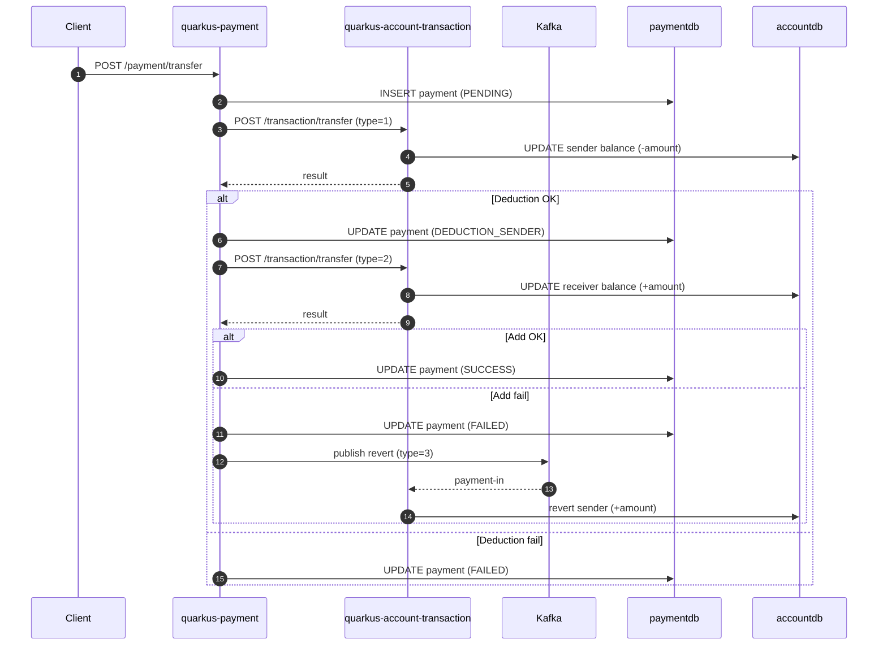
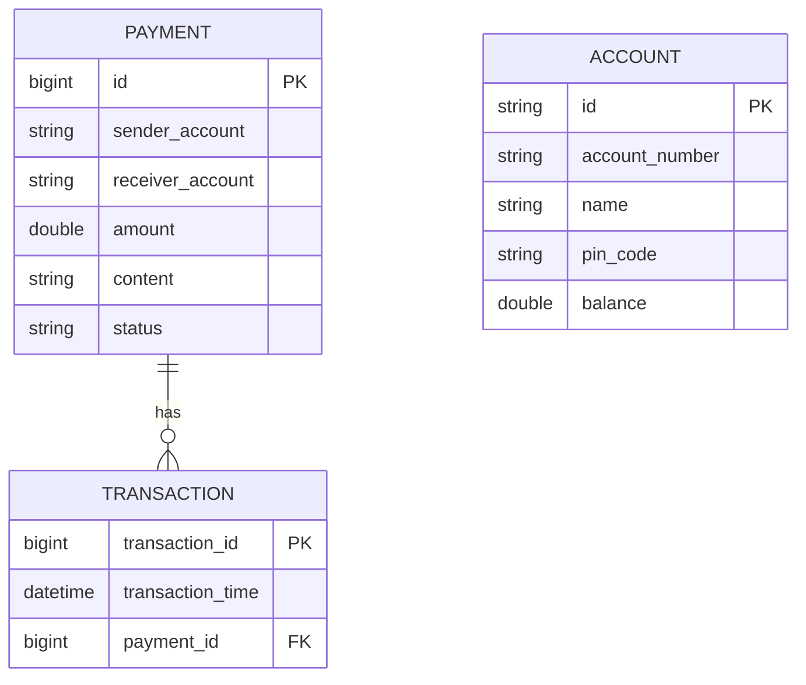

# Quarkus và GraalVM

## 1. Tổng quan Quarkus
Quarkus là framework Java tối ưu cho microservice, tập trung vào:
- Build-time augmentation: xử lý annotation, cấu hình và tối ưu ngay lúc build để giảm chi phí runtime.
- Fast startup + low memory: phù hợp cho container và scale nhanh.
- Hệ sinh thái MicroProfile/Jakarta: REST, validation, CDI, JPA, Kafka.

Trong repo này, các module Quarkus chính là:
- `quarkus-payment`
- `quarkus-account-transaction`

## 2. GraalVM và Native Image trong dự án
GraalVM Native Image biên dịch ứng dụng Java thành binary native (AOT):
- Startup nhanh, RAM thấp hơn so với JVM.
- Phù hợp cho serverless/auto-scale.
- Yêu cầu cấu hình reflection nếu dùng nhiều cơ chế động.

Hai module Quarkus đều cấu hình profile `native` trong `pom.xml`, dùng Quarkus Maven Plugin để build native.

## 3. Kiến trúc và vai trò từng service
### 3.1. `quarkus-payment`
Chức năng:
- Nhận yêu cầu chuyển tiền.
- Lưu trạng thái giao dịch vào DB.
- Gọi REST sang `quarkus-account-transaction` để trừ/ghi có.
- Gửi sự kiện Kafka để revert khi cần.

Thành phần chính:
- Controller: `PaymentController` (REST API)
- Service: `TransactionService`
- Repository: `PaymentRepository`, `TransactionRepository` (Panache)
- Entity: `PaymentEntity`, `TransactionEntity`
- Kafka: `KafkaProducer`
- REST client: `AccountTransactionClient`

### 3.2. `quarkus-account-transaction`
Chức năng:
- Tạo tài khoản.
- Trừ tiền/ghi có tài khoản.
- Revert khi nhận message Kafka.

Thành phần chính:
- Controller: `TransactionController`
- Service: `AccountService`
- Repository: `AccountRepository` (Panache)
- Entity: `AccountEntity`
- Kafka: `KafkaConsumer`

## 4. Luồng code chi tiết
### 4.1. Luồng chuyển tiền (payment -> account)
1. Client gọi `POST /payment/transfer` (PaymentController).
2. `TransactionService.transfer()` tạo `PaymentEntity` trạng thái `PENDING`.
3. Tạo `TransactionEntity` + `TransactionRequestDTO` type=1 (trừ tiền sender).
4. Gọi REST `AccountTransactionClient.transfer()` sang `quarkus-account-transaction`.
5. Nếu trừ tiền OK:
   - Update trạng thái `DEDUCTION_SENDER`.
   - Tạo request type=2 (cộng tiền receiver) và gọi REST lần 2.
   - Nếu cộng tiền OK -> status `SUCCESS`.
6. Nếu cộng tiền thất bại:
   - Status `FAILED`.
   - Tạo request type=3 (revert sender) và gửi Kafka.
7. Nếu trừ tiền thất bại: status `FAILED`.

### 4.2. Luồng balance
`POST /payment/balance` -> `AccountTransactionClient.balance()` -> trả về `AccountResponseDTO`.

### 4.3. Luồng xử lý revert qua Kafka
1. `KafkaProducer.sendToKafka()` gửi `TransactionRequestDTO` (type=3).
2. `quarkus-account-transaction` lắng nghe channel `payment-in`.
3. `KafkaConsumer.receiveFromKafka()` gọi `AccountService.revertSenderBalance()` để hoàn tiền sender.

### 4.4. Verify và cập nhật số dư (account service)
`AccountService.transfer()`:
- type=1: trừ tiền sender.
- type=2: cộng tiền receiver.
- type=3: dùng `revertSenderBalance()` để hoàn tiền.

### 4.5. Sequence diagram (chuyển tiền + revert)


### 4.6. ERD (tách 2 database)
`paymentdb`: `payment`, `transaction`  
`accountdb`: `account`


## 5. Cấu hình runtime (application.properties)
Hai service dùng cấu hình tương tự:
- DB: `${database.host}`, `${database.port}`, `${database.name}`, `${database.username}`, `${database.password}`.
- Kafka: `${kafka.host}`, `${kafka.port}` -> `kafka.bootstrap.servers`.
- Port:
  - `quarkus-payment`: `quarkus.http.port=8080`
  - `quarkus-account-transaction`: `quarkus.http.port=8090`
- REST client:
  - `quarkus-payment`: `quarkus.rest-client.transaction-api.url`

Quarkus tự map env var dạng `DATABASE_HOST`, `KAFKA_HOST`, `QUARKUS_REST_CLIENT_TRANSACTION_API_URL` sang property tương ứng.

Lưu ý từ code/config:
- `KafkaProducer` dùng channel `payment`, trong khi `application.properties` cấu hình outgoing channel `payment-out`. Nếu không đồng bộ tên channel thì producer có thể không gửi được message.

## 6. Ví dụ request/response API
Các ví dụ dùng port theo cấu hình mặc định trong repo (8080/8090).

### 6.1. Tạo tài khoản
`POST http://localhost:8090/transaction/new`
```json
{
  "accountNumber": "ACC-001",
  "pinCode": "123456",
  "name": "Nguyen Van A",
  "balance": 1000000
}
```
Response mẫu:
```json
{
  "statusCode": 201,
  "message": "Create account successfully",
  "data": {
    "id": "8b4a9a8e-1a7e-4e18-9c10-6c12b7ad1a11",
    "accountNumber": "ACC-001",
    "name": "Nguyen Van A",
    "balance": 1000000
  }
}
```

### 6.2. Chuyển tiền
`POST http://localhost:8080/payment/transfer`
```json
{
  "senderAccount": "ACC-001",
  "receiverAccount": "ACC-002",
  "amount": 50000,
  "content": "Chuyen tien",
  "pinCode": "123456"
}
```
Response mẫu:
```json
{
  "statusCode": 200,
  "message": "Completed action",
  "data": {
    "requestId": 101,
    "transactionId": 2001,
    "senderAccount": "ACC-001",
    "receiverAccount": "ACC-002",
    "amount": 50000,
    "content": "Chuyen tien",
    "details": [
      {
        "transactionId": 2001,
        "accountNumber": "ACC-001",
        "content": "DEDUCTION_SENDER",
        "amount": 50000
      },
      {
        "transactionId": 2002,
        "accountNumber": "ACC-002",
        "content": "ADD_RECEIVER",
        "amount": 50000
      }
    ]
  }
}
```

### 6.3. Tra cứu số dư
`POST http://localhost:8080/payment/balance`
```json
{
  "accountNumber": "ACC-001",
  "pinCode": "123456"
}
```
Response mẫu:
```json
{
  "statusCode": 200,
  "message": "Fetch data successfully",
  "data": {
    "id": "8b4a9a8e-1a7e-4e18-9c10-6c12b7ad1a11",
    "accountNumber": "ACC-001",
    "name": "Nguyen Van A",
    "balance": 950000
  }
}
```

### 6.4. Lấy danh sách giao dịch
`GET http://localhost:8080/payment/query/all`
Response mẫu:
```json
{
  "statusCode": 200,
  "message": "Fetch data successfully",
  "data": [
    {
      "id": 101,
      "senderAccount": "ACC-001",
      "receiverAccount": "ACC-002",
      "amount": 50000.0,
      "content": "Chuyen tien",
      "status": "SUCCESS",
      "transactions": [
        {
          "transactionId": 2001,
          "transactionTime": "2024-08-01T10:15:00"
        }
      ]
    }
  ]
}
```

## 7. Build và chạy hệ thống Quarkus
### 7.1. Dev mode (hot reload)
```bash
./mvnw compile quarkus:dev
```

### 7.2. Build JVM jar
```bash
./mvnw package
java -jar target/quarkus-app/quarkus-run.jar
```
Thư mục build: `target/quarkus-app/` (không phải uber-jar).

### 7.3. Build Uber-jar
```bash
./mvnw package -Dquarkus.package.jar.type=uber-jar
java -jar target/*-runner.jar
```

### 7.4. Build Native Image (GraalVM)
```bash
./mvnw package -Dnative
./target/*-runner
```
Hoặc build native qua container:
```bash
./mvnw package -Dnative -Dquarkus.native.container-build=true
```

### 7.5. Build Docker image
JVM mode:
```bash
docker build -f src/main/docker/Dockerfile.jvm -t quarkus/quarkus-payment-jvm .
```
Native mode:
```bash
docker build -f src/main/docker/Dockerfile.native -t quarkus/quarkus-account-transaction .
```

## 8. Triển khai bằng Docker Compose (local hoặc VM)
File `docker-compose/docker-compose.yml` gồm:
- Kafka (Bitnami Kafka 3.7)
- MySQL `paymentdb` và `accountdb`
- `quarkus-payment` (port 8080)
- `quarkus-account-transaction` (port 8090)
- (có thêm Spring services để so sánh)

Các biến môi trường quan trọng:
- `KAFKA_HOST`, `KAFKA_PORT`
- `DATABASE_HOST`, `DATABASE_PORT`, `DATABASE_NAME`, `DATABASE_USERNAME`, `DATABASE_PASSWORD`
- `QUARKUS_REST_CLIENT_TRANSACTION_API_URL` trỏ tới `quarkus-account-transaction:8090`

Chạy:
```bash
docker compose -f docker-compose/docker-compose.yml up -d
```

## 9. Triển khai trên Cloud với Kubernetes
Thư mục `kubernetes/` sử dụng Helm và các manifest MySQL/Kafka.

### 9.1. Kafka
`kubernetes/kafka/` là chart Bitnami Kafka (values.yaml đầy đủ).

### 9.2. MySQL
- `kubernetes/paymentdb.yaml`: Deployment + Service cho `paymentdb` (port 3305).
- `kubernetes/accountdb.yaml`: Deployment + Service cho `accountdb` (port 3304).

### 9.3. Quarkus services (Helm)
Mỗi service có chart riêng:
- `kubernetes/quarkus-payment`
- `kubernetes/quarkus-account-transaction`

Chart dùng `bank-common` để tái sử dụng template:
- `bank-common/templates/deployment.yaml` inject env qua ConfigMap.
- `bank-common/templates/service.yaml` tạo Service dạng `LoadBalancer`.

`bank-runner` là chart tổng hợp:
- `kubernetes/bank-runner/values.yaml` định nghĩa global config (Kafka, DB, REST client).
- `kubernetes/bank-runner/templates/configMap.yaml` tạo ConfigMap chung.

### 9.4. Gợi ý luồng triển khai
```bash
# 1) Cài Kafka
helm install kafka kubernetes/kafka

# 2) Cài MySQL
kubectl apply -f kubernetes/paymentdb.yaml
kubectl apply -f kubernetes/accountdb.yaml

# 3) Cài các service (Quarkus + Spring nếu muốn)
helm install bank-runner kubernetes/bank-runner
```

Ghi chú khi lên Cloud:
- `LoadBalancer` sẽ cấp external IP; cần cấu hình firewall/ingress theo nhu cầu.
- Images phải push lên registry mà cluster truy cập được.
- Nên chuyển mật khẩu DB sang Secret (hiện đang hardcode trong values).

### 9.5. Checklist triển khai Cloud
- Namespace: tạo namespace riêng cho stack banking, tách khỏi default.
- Image: push image lên registry, set `imagePullSecrets` nếu private.
- Config/Secret: dùng ConfigMap cho host/port và Secret cho password DB.
- Storage: bổ sung PersistentVolume cho MySQL (hiện manifest chưa có PVC).
- Networking: chọn `LoadBalancer` hoặc Ingress, cấu hình DNS/TLS nếu public.
- Observability: bật readiness/liveness, log/metrics, và alert cơ bản.

## 10. Hướng dẫn chi tiết cho người mới học Quarkus (theo code hiện có)
Mục này giải thích các khái niệm Quarkus dựa trực tiếp trên 2 module:
`quarkus-payment` và `quarkus-account-transaction`.

### 10.1. Cấu trúc thư mục dự án Quarkus
Mỗi module Quarkus có layout chuẩn:
- `src/main/java`: code Java (controller, service, repository, entity, config).
- `src/main/resources/application.properties`: cấu hình runtime.
- `src/main/docker/`: Dockerfile cho JVM/native.
- `pom.xml`: cấu hình Maven + Quarkus extensions.

### 10.2. REST API trong Quarkus
Quarkus dùng Jakarta REST (JAX-RS). Ví dụ ở `quarkus-payment`:
```java
@Path("/payment")
@Produces(MediaType.APPLICATION_JSON)
@Consumes(MediaType.APPLICATION_JSON)
public class PaymentController {
  @POST
  @Path("/transfer")
  public GeneralResponse<TransactionResponseDTO> transfer(@Valid TransferRequestDTO requestDTO) {
    ...
  }
}
```
Ý nghĩa:
- `@Path`: định nghĩa base path cho controller.
- `@POST`, `@GET`: mapping endpoint.
- `@Consumes`, `@Produces`: định dạng request/response.
- `@Valid`: bật validation cho DTO.

### 10.3. Validation DTO
DTO có annotation validation:
```java
public class TransferRequestDTO {
  @NotBlank private String senderAccount;
  @Positive private Integer amount;
}
```
Nếu request không hợp lệ, Quarkus trả về lỗi 400 tự động.

### 10.4. Dependency Injection (CDI)
Quarkus dùng CDI. Ví dụ:
```java
@ApplicationScoped
public class TransactionService {
  @Inject PaymentRepository paymentRepository;
}
```
Giải thích:
- `@ApplicationScoped`: bean sống theo vòng đời ứng dụng.
- `@Inject`: tự động inject dependency.

### 10.5. JPA Entity + Panache Repository
Entity dùng JPA:
```java
@Entity(name = "payment")
public class PaymentEntity {
  @Id @GeneratedValue(strategy = GenerationType.IDENTITY)
  private Long id;
}
```
Repository dùng Panache:
```java
@ApplicationScoped
public class PaymentRepository implements PanacheRepositoryBase<PaymentEntity, Long> {}
```
Panache cung cấp sẵn API: `find`, `listAll`, `persist`,...

### 10.6. Transaction trong service
Các thao tác ghi DB đặt trong `@Transactional`:
```java
@Transactional
public TransactionResponseDTO transfer(...) {
  paymentRepository.persist(paymentEntity);
}
```
Giúp đảm bảo commit/rollback đúng khi có lỗi.

### 10.7. REST Client giữa service
Quarkus tích hợp MicroProfile Rest Client:
```java
@RegisterRestClient(configKey = "transaction-api")
public interface AccountTransactionClient {
  @POST @Path("/transfer")
  GeneralResponse<Boolean> transfer(TransactionRequestDTO requestDto);
}
```
Cấu hình endpoint trong `application.properties`:
```
quarkus.rest-client.transaction-api.url=http://localhost:8090
```

### 10.8. Kafka và Reactive Messaging
Quarkus dùng SmallRye Reactive Messaging:
- Producer:
```java
@Channel("payment")
Emitter<TransactionRequestDTO> emitter;
```
- Consumer:
```java
@Incoming("payment-in")
public void receiveFromKafka(TransactionRequestDto requestDTO) { ... }
```
Channel mapping được cấu hình trong `application.properties` với prefix `mp.messaging`.

### 10.9. Cấu hình application.properties
Config hỗ trợ placeholder:
```
quarkus.datasource.jdbc.url=jdbc:mysql://${database.host}:${database.port}/${database.name}
```
Khi chạy container, env var `DATABASE_HOST` sẽ map vào `database.host`.

### 10.10. Lombok trong project
Code dùng Lombok để giảm boilerplate:
- `@Data`: auto getter/setter/toString.
- `@Builder`: builder pattern.
Khi mở code cần nhớ đây là Lombok, không thấy method trong source.

### 10.11. Dev mode và Live Coding
Chạy:
```bash
./mvnw compile quarkus:dev
```
Quarkus tự reload khi sửa code, có Dev UI tại:
`http://localhost:8080/q/dev/`

### 10.12. Tóm tắt cách mở rộng dự án
Nếu muốn thêm API mới:
1. Tạo DTO request/response trong `dto/`.
2. Tạo endpoint trong controller (`@Path`, `@POST`).
3. Tạo logic trong service (`@ApplicationScoped`).
4. Nếu cần DB: tạo Entity + Repository (Panache).
5. Cập nhật `application.properties` khi thêm config mới.
